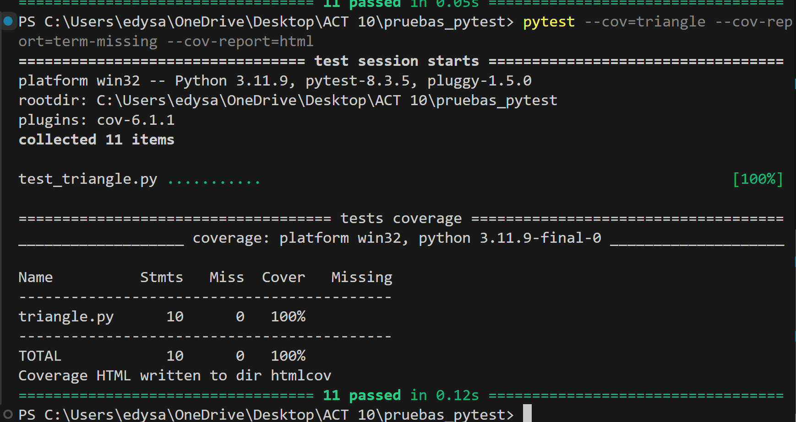

# Actividad: Ejecutar pruebas con pytest
En esta actividad vamos a prender a como utilizar herramientas fundamentales para ejecutar pruebas unitarias en Python utilizando el framework pytest.

### Paso 1: Instalando pytest y pytest-cov
Instalaremos pytest que nos permitira generar informes de cobertura de codigo.

Esto instalará pytest para ejecutar pruebas y pytest-cov para generar informes de cobertura de código.

### Paso 2: Escribiendo y ejecutando pruebas con pytest
pytest te permite escribir pruebas de manera sencilla sin necesidad de usar clases como en unittest. Probamos correr las pruebas de la actividad con `pytest -v`

La opción -v activa el modo detallado, mostrándote qué pruebas se ejecutaron y sus resultados.

### Paso 3: Añadiendo cobertura de pruebas con pytest-cov
Es importante saber cuánta parte de nuestro código está siendo cubierta por las pruebas por eso usamos el complemento `pytest-cov`.
Ejecutamos `pytest --cov=nombre_de_tu_paquete`.

Si también deseas generar un informe de cobertura en HTML para visualizarlo, puedes agregar la opción `--cov-report=html`:

Si solo deseas medir la cobertura de un módulo específico como modulo1.py, el comando sería:

Este comando generará un informe de cobertura que mostrará el porcentaje de líneas de código cubiertas por las pruebas.

Si deseas un informe más detallado que muestre las líneas que no están cubiertas, ejecuta el siguiente comando:

Este informe te mostrará las líneas de código faltantes que no han sido cubiertas por las pruebas.

Si además deseas un informe en HTML con el mismo detalle, puedes combinarlo de la siguiente manera:

### Paso 4: Añadiendo colores automáticamente

pytest ya viene con soporte de colores por defecto, por lo que no necesitas instalar ningún complemento adicional para tener una salida visualmente agradable.
Si por alguna razón los colores no se muestran, puedes forzarlos con la opción `--color=yes`.

### Paso 5:  Automatizando la configuración de pytest 

En lugar de escribir todos los parámetros de configuración cada vez que ejecutes pytest, puedes guardarlos en un archivo pytest.ini o como se ha realizado aqui setup.
#### setup.cfg
Es un archivo de configuración general de todo el paquete o proyecto. Se puede usar para configurar varias herramientas relacionadas con el proyecto, como pytest, flake8, mypy, y otras herramientas que utilicen secciones específicas dentro del archivo.

Este archivo te permitirá automatizar la configuración de las pruebas.

Es un archivo **pytest.ini** hay configuraciones específicas para pytest. Solo contiene configuraciones que pytest usa directamente.

**¿Cuál usar?**

* Si ya tienes un setup.cfg y deseas centralizar la configuración de varias herramientas en un solo archivo, puedes seguir usando setup.cfg.

* Si solo necesitas configurar pytest y prefieres mantener los archivos separados o más simples, entonces pytest.ini es una buena opción.

### Paso 6: Ejecutando pruebas con la configuración automatizada 

Una vez que hemos creado el archivo o setup.cfg pytest.ini, simplemente ejecutamos pytest sin ningún parámetro adicional:

Esto ejecutará las pruebas con los parámetros definidos en el archivo de configuración, ahorrándonos la necesidad de escribirlos cada vez.