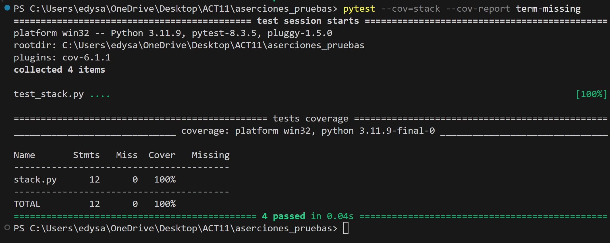

# Actividad: Escribir aserciones en pruebas con pytest

En esta actividad aprenderemos cómo escribir aserciones de pruebas utilizando pytest y otros complementos actualizados.

### Paso 1: Instalación de `pytest` y `pytest-cov`

Comencemos instalando las herramientas necesarias. 

### Paso 2: Archivos de prueba

Usaremos dos archivos para esta actividad: `stack.py` y `test_stack.py`.

* stack.py: Contiene la implementación de una pila (stack) que queremos probar.

* test_stack.py: Contiene el esqueleto de las pruebas para los métodos push(), pop(), peek(), y is_empty().

Descripción de funciones:

* `push()`: Añade un elemento a la parte superior de la pila.
* `pop()`: Elimina y devuelve el elemento en la parte superior de la pila.
* `peek()`: Devuelve el valor del elemento en la parte superior de la pila sin eliminarlo.
* `is_empty()`: Devuelve True si la pila está vacía y False si no lo está.

Ten en cuenta que todos los métodos, excepto is_empty(), operan sobre el elemento que se encuentra en la parte superior de la pila. 

Podemos verificar al inicio de que las pruebas no pasan con pytest:

En pytest, puedes usar la opción `-x` o `--exitfirst` para detener la ejecución de las pruebas al encontrar el primer fallo.

o

### Paso 3: Escribiendo aserciones para el `método is_empty()`

Vamos a comenzar con la prueba del método is_empty(). Este método devuelve True si la pila está vacía y False si no lo está.

Modificamos la función test_is_empty() en test_stack.py para que se vea así:

Comprobamos con este código tambien:

### Paso 4: Ejecuta pytest para verificar `is_empty()`

Ejecutamos pytest para verificar si la prueba del método `is_empty()` pasa:

Me salio un eeror debido a una mala implementacion, corregimos:

Ejecutamos `pytest -v`:

Podemos ver que `is_empty()` ha pasado. 

### Paso 5: Escribiendo aserciones para el método `peek()`

El siguiente método que vamos a probar es peek(). Este método devuelve el valor en la parte superior de la pila sin eliminarlo.

Modificamos la función test_peek() en test_stack.py de la siguiente manera:

Comprobamos con este código tambien:

Ejecutamos:

### Paso 6: Escribiendo aserciones para el método `pop()`

El método `pop()` elimina y devuelve el valor en la parte superior de la pila. Para asegurarte de que la prueba es útil, debes agregar al menos dos valores a la pila.

Modificamos la función `test_pop()` en `test_stack.py`:

Comprobamos con este código tambien:

Ejecutamos: 

### Paso 7: Escribiendo aserciones para el método `push()`

Finalmente, vamos a probar el método push(), que añade un valor a la pila.

Modificamos la función `test_push()` en `test_stack.py`:

Compronamos con este código tambien:

### Paso 8: Ejecuta pytest para verificar todas las pruebas

Ejecuta pytest nuevamente para asegurarte de que todas las pruebas pasan:

### Paso 9: Agregando cobertura de pruebas con pytest-cov

Para asegurarte de que tus pruebas cubren suficiente código, puedes generar un informe de cobertura utilizando pytest-cov.

Esto te mostrará cuántas líneas de código están cubiertas por las pruebas y cuáles no.

#

El archivo `setup.cfg` configura `pytest` y `coverage` para ejecutar pruebas en modo detallado, mostrar trazas cortas de errores, calcular cobertura del archivo `stack.py` e informar líneas no cubiertas. Además, incluye cobertura de ramas, omite archivos de prueba del análisis, y muestra las líneas no cubiertas en el reporte final para facilitar la identificación de partes del código sin probar.