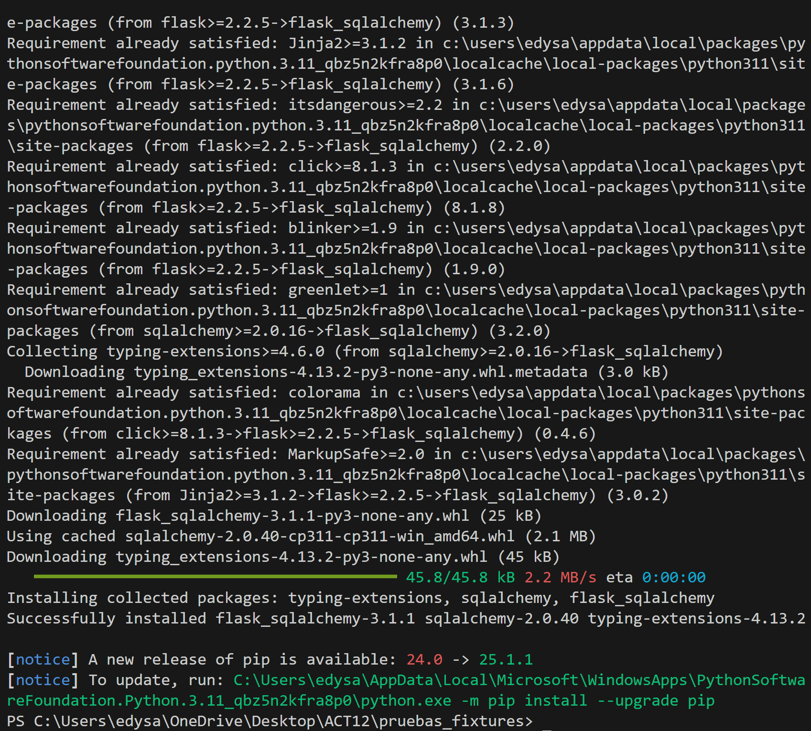
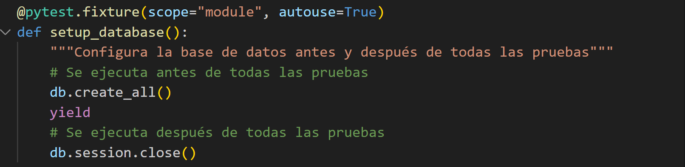
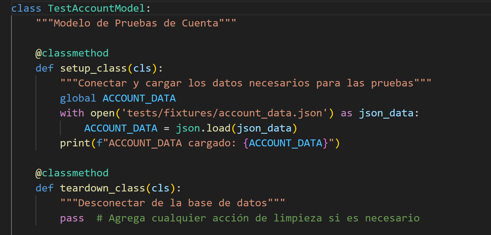
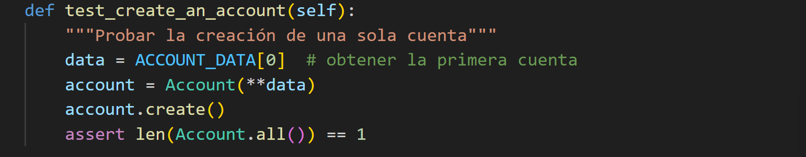
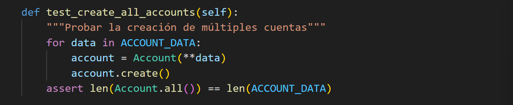
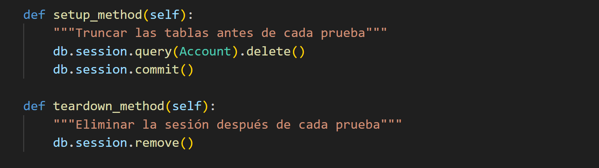

# Actividad 12: Revisión de fixtures en pruebas

En esta actividad, aprenderás a utilizar los diferentes fixtures de prueba que están disponibles en el paquete `pytest`.
Instalamos flask con : `pip install flask_sqlalchemy`

### Paso 1: Inicializar la base de datos

En este paso, configurarás un fixture de prueba para conectar y desconectar de la base de datos.

**Tarea**
Piensa en qué fixtures son más adecuados para conectar a la base de datos antes de todas las pruebas y desconectar después de todas las pruebas. En este caso, usaremos un fixture a nivel de módulo para realizar esta operación.

El siguiente código de SQLAlchemy te ayudará a hacerlo:

* db.create_all(): Crea las tablas en la base de datos.
* db.session.close(): Cierra la conexión a la base de datos.

***Solucion**
En `pytest`, crea un fixture que ejecute estas acciones a nivel de módulo:

Este fixture se ejecutará automáticamente antes de todas las pruebas del módulo y cerrará la sesión de la base de datos al finalizar todas las pruebas.

### Paso 2: Cargar datos de prueba
En este paso, cargarás algunos datos de prueba que serán usados durante las pruebas. 

**Tarea**
En la carpeta tests/fixtures, hay un archivo llamado account_data.json que contiene los datos de prueba.

Cargarás estos datos en una variable global llamada ACCOUNT_DATA. El código Python para cargar los datos es:

***Solucion**
Dentro de la clase de pruebas `TestAccountModel`, utiliza el método `setup_class` para cargar los datos de prueba antes de que se ejecuten las pruebas:

### Paso 3: Escribir un caso de prueba para crear una cuenta

Ahora que hemos configurado los fixtures y cargado los datos de prueba, podemos escribir tu primer caso de prueba. Crearemos una cuenta utilizando el diccionario `ACCOUNT_DATA`.

**Tarea**
La clase `Account` tiene un método `create()` que puede usarse para agregar una cuenta a la base de datos, y un método `all()` que devuelve todas las cuentas.

Escribe un caso de prueba que cree una cuenta y luego llame al método `Account.all()` para asegurar que se devuelve una cuenta.

***Solucion**

Dentro de la clase TestAccountModel, agregamos el siguiente método de prueba:

### Paso 4: Escribir un caso de prueba para crear todas las cuentas
Después de verificar que se puede crear una sola cuenta, ahora escribirás una prueba que cree todas las cuentas del diccionario `ACCOUNT_DATA`.

**Tarea**

Usa un bucle `for` para cargar todos los datos del diccionario `ACCOUNT_DATA`, luego usa el método `Account.all()` para recuperarlas y asegúrate de que el número de cuentas devuelto es igual al número de cuentas en los datos de prueba.

**Solucion**

Añade el siguiente método de prueba a la clase `TestAccountModel`:

### Paso 5: Limpiar las tablas antes y después de cada prueba
Es probable que tus pruebas fallen porque los datos de pruebas anteriores están afectando el resultado de las siguientes pruebas. Para evitar esto, debes agregar métodos que limpien las tablas antes y después de cada prueba.

**Tarea**
Utiliza los métodos setup_method y teardown_method dentro de la clase de pruebas para limpiar la base de datos antes y después de cada prueba.

**Solucion**

Dentro de la clase `TestAccountModel`, agregamos los siguientes métodos:

# *

Recordemos que:

* El método `setup_class` se ejecuta una vez antes de todas las pruebas de la clase.
* El método `teardown_class` se ejecuta una vez después de todas las pruebas de la clase.
* El método `setup_method` se ejecuta antes de cada método de prueba.
* El método `teardown_method` se ejecuta después de cada método de prueba.