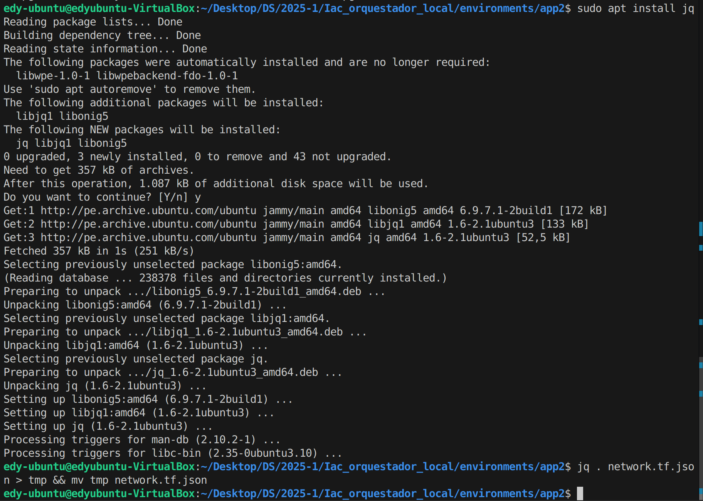

### Actividad 20: Escribiendo infraestructura como código en un entorno local con Terraform

#### Fase 0: Preparación 

1. **Revisa**:

   ```
   modules/simulated_app/
     ├─ network.tf.json
     └─ main.tf.json
   generate_envs.py
   ```
    
2. **Verifica** que puedes ejecutar:

   ```bash
   python generate_envs.py
   cd environments/app1
   terraform init
   ```
    

3. **Objetivo**: conocer la plantilla base y el generador en Python.

####  Fase 1: Expresando el cambio de infraestructura

* **Pregunta**

  * ¿Cómo interpreta Terraform el cambio de variable?
    
    Lo que hace Terrafomr en detectar el cambio al comprar el valor actual de la variable con su estado anteriror y aplica solo las diferencias al recurso afectado.

  * ¿Qué diferencia hay entre modificar el JSON vs. parchear directamente el recurso?
  
    La diferencia es qu emodificar el JSON cambia la configuracion y parchear el recurso salta el control de Terraform y debido a esto puede causar que el estado se desincronice.

  * ¿Por qué Terraform no recrea todo el recurso, sino que aplica el cambio "in-place"?
    
    Porque es una forma mas eficiente ya que Terraform solo actualiza lo necesario para evitar la destruccion y conflictos de recursos. 

  * ¿Qué pasa si editas directamente `main.tf.json` en lugar de la plantilla de variables?
  
    En ese caso se perderia la reutilizacion el codigo.

#### Procedimiento

1. En `modules/simulated_app/network.tf.json`, cambia:

   ```diff
     "network": [
       {
   -     "default": "net1",
   +     "default": "lab-net",
         "description": "Nombre de la red local"
       }
     ]
   ```
        

2. Regenera **solo** el app1:

   ```bash
   python generate_envs.py
   cd environments/app1
   terraform plan
   ```
    
   Observa que el **plan** indica:

   > \~ null\_resource.app1: triggers.network: "net1" -> "lab-net"

#### Fase 2: Entendiendo la inmutabilidad

#### A. Remediación de 'drift' (out-of-band changes)

1. **Simulación**

   ```bash
   cd environments/app2
   # edita manualmente main.tf.json: cambiar "name":"app2" ->"hacked-app"
   ```
2. Ejecuta:

   ```bash
   terraform plan
   ```
    
    
    Vemos un plan que propone **revertir** ese cambio.

3. **Aplica**

   ```bash
   terraform apply
   ```
    Y comprueba que vuelve a "app2".
   
    

#### B. Migrando a IaC

* **Mini-reto**
 1. Crea en un nuevo directorio `legacy/` un simple `run.sh` + `config.cfg` con parámetros (p.ej. puerto, ruta).

    ```
     echo 'PORT=8080' > legacy/config.cfg
     echo '#!/bin/bash' > legacy/run.sh
     echo 'echo "Arrancando $PORT"' >> legacy/run.sh
     chmod +x legacy/run.sh
     ```
     
  2. Escribe un script Python que:

     * Lea `config.cfg` y `run.sh`.
     * Genere **automáticamente** un par `network.tf.json` + `main.tf.json` equivalente.
      

     * Verifique con `terraform plan` que el resultado es igual al script legacy.
      

     * Ahora le damos `terraform apply`:
      
 

#### Fase 3: Escribiendo código limpio en IaC 

| Conceptos                       | Ejercicio rápido                                                                                               |
| ------------------------------------------ | -------------------------------------------------------------------------------------------------------------- |
| **Control de versiones comunica contexto** | - Haz 2 commits: uno que cambie `default` de `name`; otro que cambie `description`. Revisar mensajes claros. |

1. Cambia el `default` de name (por ejemplo, de "app2" a "web-app")

   Realizamos el commit:
   

2. El segundo sera cambiar la descripción de un recurso
   `"description": "Servidor principal de la aplicación"`


| Conceptos                       | Ejercicio rápido                                                                                               |
| ------------------------------------------ | -------------------------------------------------------------------------------------------------------------- |
| **Linting y formateo**                     | - Instala `jq`. Ejecutar `jq . network.tf.json > tmp && mv tmp network.tf.json`. 


¿Qué cambió?       
* La orden de claves podria cambiar ligeramente, pero la estructura logica no cambia.          


| Conceptos                       | Ejercicio rápido                                                                                               |
| ------------------------------------------ | -------------------------------------------------------------------------------------------------------------- |
| **Nomenclatura de recursos**               | - Renombra en `main.tf.json` el recurso `null_resource` a `local_server`. Ajustar generador Python.           |

Cambiamos main.tf.json:
   

Cambiamos migrar.py:
   

Realizamos el commit:
   


| Conceptos                       | Ejercicio rápido                                                                                               |
| ------------------------------------------ | -------------------------------------------------------------------------------------------------------------- |
| **Variables y constantes**                 | - Añade variable `port` en `network.tf.json` y usarla en el `command`. Regenerar entorno.                     |

1. Agrega una variable `port` en `network.tf.json`:
   

   Realizamos el `terraform init`:
   

   Realizamos el `terraform plan`:
   


#### Fase 4: Integración final y discusión

**Preguntas abiertas**:

   * **¿Cómo extenderías este patrón para 50 módulos y 100 entornos?**

      Modularizando bien los recursos y generando entornos con un script parametrizado por nombre, red o puerto, tambine usando layouts de carpetas como module y enviroments.

   * **¿Qué prácticas de revisión de código aplicarías a los `.tf.json`?**

      Se podria usar el pre-commit con `jq` para validar formato, revision por pares con `git diff` y validacion con `terraform validate`.

   * **¿Cómo gestionarías secretos en producción (sin Vault)?**
      
      Se podria leer desde archivos fuera de la repo o desde variables de entorno y se podria usar `sensitive = true` para evitar fugas en el plan o el estado.


   * **¿Qué workflows de revisión aplicarías a los JSON generados?**
Ejecutaria la validacion de esquema JSON con formatos jq y validaciones con `terraform validate`.


