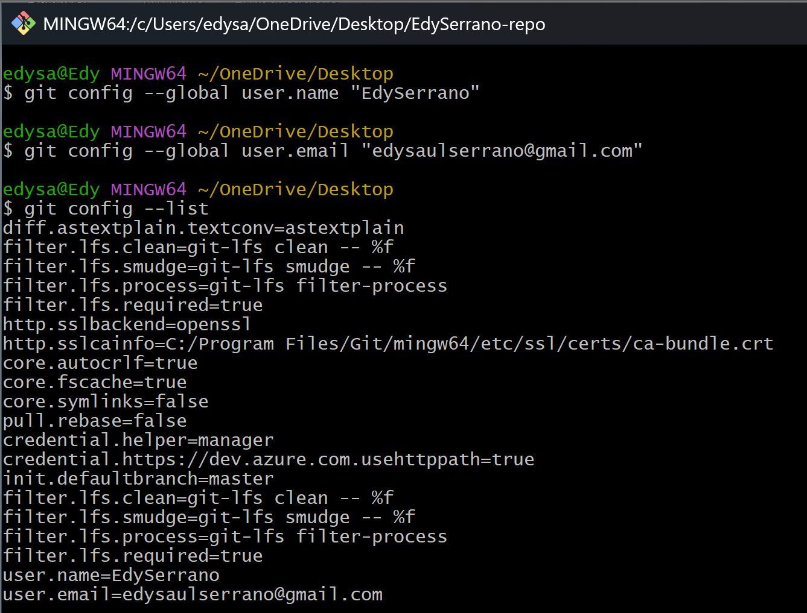
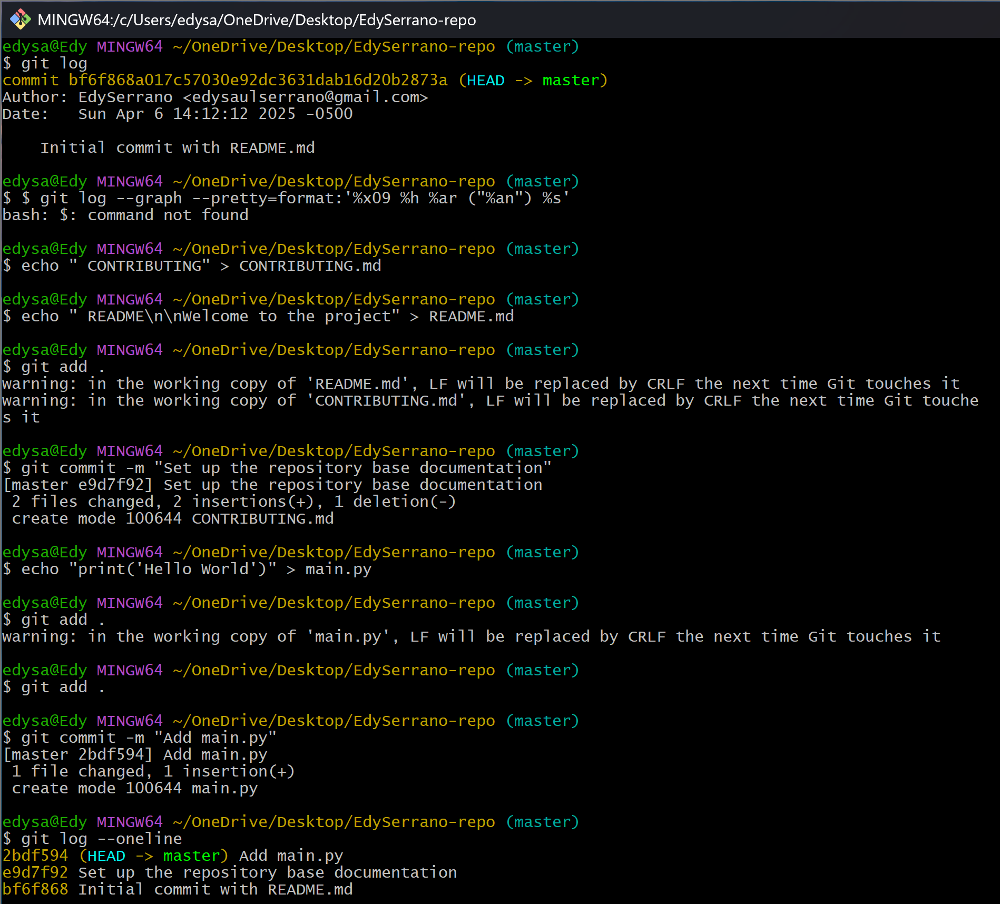
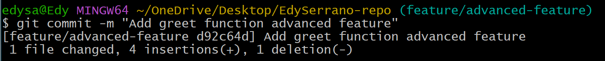
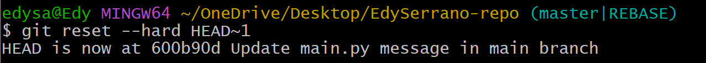

# Actividad: Introduccion a Git - Conceptos basicos y operaciones esenciales

### **git config:** Preséntate a Git

### **git init:** Donde comienza tu viaje de código

### **git add:** Preparando tu código

### **git commit:** registra cambios

### **git log:** Recorrer el árbol de commits

## Trabajar con ramas: La piedra angular de la colaboración

### **git checkout/git switch:** Cambiar entre ramas

### **Ejemplos adicionales**

### **Crear una rama desde un commit específico**

### **git merge :** Fusionando ramas

### **git branch -d:** Eliminando una rama

### Preguntas
1. **¿Cómo te ha ayudado Git a mantener un historial claro y organizado de tus cambios?**

    Mediante lo comandos vistos puedo ver los cambios que eh realizado con sus descripciones para poder ver el proposito de cada cambio.

2. **¿Qué beneficios ves en el uso de ramas para desarrollar nuevas características o corregir errores?**

    Bueno las ramas nos permiten trabajar en nuevas funcionalidades sin que afecten el resto de codigo, y asi cada integrante del equipo puede tener su rama propia y luego despues de la verificacion unir las ramas.

3. **Realiza una revisión final del historial de commits para asegurarte de que todos los cambios se han registrado correctamente.**

    Ahi en la imagen, gracias al **git log** puedo ver los commits que se hicieron y por quienes.

    

4. **Revisa el uso de ramas y merges para ver cómo Git maneja múltiples líneas de desarrollo.**

    Con git podemos manejar varias ramas y al usar **git merge** podemos unirlas pero primero debemos ubicarnos en la rama a la que deseamos fusionar.

    
    #
#

# Ejercicios
## **Ejercicio 1:** Manejo avanzado de ramas y resolución de conflictos
1. **Crear una nueva rama para una característica:**

2. **Modificar archivos en la nueva rama:**

3. **Simular un desarrollo paralelo en la rama main:**

4. **Intentar fusionar la rama feature/advanced-feature en main:**

5. **Resolver el conflicto de fusión:**

6. **Eliminar la rama fusionada:**

## **Ejercicio 2:** Exploración y manipulación del historial de commits

1. **Ver el historial detallado de commits:**

2. **Filtrar commits por autor:**

3. **Revertir un commit:**

4. **Rebase interactivo:**

5. **Visualización gráfica del historial:**

## **Ejercicio 3:** Creación y gestión de ramas desde commits específicos

1. **Crear una nueva rama desde un commit específico:**

2. **Modificar y confirmar cambios en la nueva rama:**

3. **Fusionar los cambios en la rama principal:**

4. **Explorar el historial después de la fusión:**

5. **Eliminar la rama bugfix/rollback-feature:**

## **Ejercicio 4:** Manipulación y restauración de commits con git reset y git restore

1. **Hacer cambios en el archivo main.py:**

2. **Usar git reset para deshacer el commit:**

3. **Usar git restore para deshacer cambios no confirmados:**

## **Ejercicio 5:** Trabajo colaborativo y manejo de Pull Requests

1. **Crear un nuevo repositorio remoto:**

2. **Crear una nueva rama para desarrollo de una característica:**

3. **Realizar cambios y enviar la rama al repositorio remoto:**

4. **Abrir un Pull Request:**

5. **Revisar y fusionar el Pull Request:**

6. **Eliminar la rama remota y local:**

## **Ejercicio 6:** Cherry-Picking y Git Stash

1. **Hacer cambios en main.py y confirmarlos:**

2. **Crear una nueva rama y aplicar el commit específico:**

3. **Guardar temporalmente cambios no confirmados:**

4. **Aplicar los cambios guardados:**

5. **Revisar el historial y confirmar la correcta aplicación de los cambios:**
