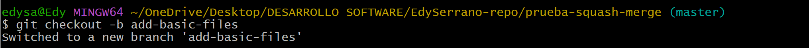
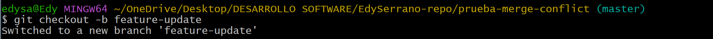
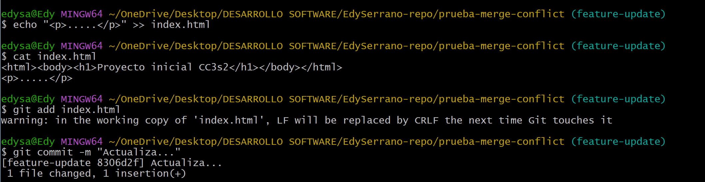
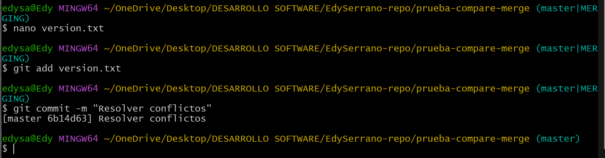

# **Actividad 5:** Explorando diferentes formas de fusionar en Git

Hay 3 metodos para fusionar ramas y  son: Fast-Forward, no Fast-Forward y squash.

#### **1. Fast-forward: Mantener un historial limpio y lineal**
Es la opcion predeterminada y mas simple cuando no se han realizado commits en la rama principal desde su creacion. El historial de commits permanece lineal. Es ideal 	para proyectos pequeños donde no se realizan multiples contribuciones paralelas. 

#### **2. No-fast-forward: Preservar el contexto de los cambios**
A diferencia del anterior, este crea un commit de fusion que preserva explicitamente  el momento y el contexto en el que se integraron las ramas. 
Es mas util en proyecto grandes donde los desarrolladores trabajan simultaneamente.
Al realizar un commit de fusion no-fast-forward se tiene 2 parents commit, uno es la rama origen y el otro la rama destino, con este enfoque se puede revisar los historiales de manera eficiente, para saber cuando y porque se unieron a la rama principal.
El continuo uso de esta fusion puede desordenar el historial lo que dificulta la lectura, solo deben realizarse en fusiones importantes.

#### **3. Squash: Condensar cambios para una rama principal limpia**
Este metodo esta orientado en mantener el historial limpio al integrar las rama, esta tecnica agarra todos los commits de la rama principal y los aplasta en un solo commit antes de fusionarlos con la rama principal. Es ideal en proyecto donde se prioriza la simplicidad y claridad del codigo.
Este metodo es comun en metodologias agiles, CI/CD y DevOps, donde se busca integrar  frecuentemente en ciclos cortos.
La desventaja esque al aplastar los commits se pierde los detalles del historial, como los cambios realizados en las ramas, esto dificulta mucho si se quiere entender 	el cambio del codigo en un futuro.

#

### **Ejemplos**

#### **1. Fusión Fast-forward (git merge --ff)**
###### Crear un nuevo repositorio

###### Crear y cambiar a una nueva rama 'add-description'

###### Ver el historial lineal

#

#### **2. Fusión No-fast-forward (git merge --no-ff)**

###### Crear un nuevo repositorio

###### Agregar un archivo inicial en la rama principal (main)

###### Crear y cambiar a una nueva rama 'add-feature' y hacer cambios en la nueva rama y comitearlos

###### Cambiar de vuelta a la rama 'main' y realizar una fusión no-fast-forward

###### Ver el historial

#

#### **3. Fusión squash (git merge --squash)**

###### Crear un nuevo repositorio

###### Agregar un archivo inicial en la rama principal (main)

###### Crear y cambiar a una nueva rama 'add-basic-files'

###### Hacer algunos cambios y comitearlos

###### Cambiar de vuelta a la rama 'main' y realizar la fusión squash

###### Para completar la fusión squash, realiza un commit:

#

### **Ejercicios**

### 1. Clona un repositorio Git con múltiples ramas.
Identifica dos ramas que puedas fusionar utilizando **git merge --ff**.
Haz el proceso de fusión utilizando **git merge --ff**. 
Verifica el historial con git log --graph --oneline.

**Pregunta: ¿En qué situaciones recomendarías evitar el uso de git merge --ff? Reflexiona sobre las desventajas de este método.**

Evita **--ff** cuando quieras preservar el historial de que hubo una rama separada ya que es util en equipos o para identificar que feature se desarrolló por separado.

### 2. Simula un flujo de trabajo de equipo.

Trabaja en dos ramas independientes, creando diferentes cambios en cada una.
Fusiona ambas ramas con **git merge --no-ff** para ver cómo se crean los commits de fusión.
Observa el historial utilizando git log --graph --oneline.

**Pregunta: ¿Cuáles son las principales ventajas de utilizar git merge --no-ff en un proyecto en equipo? ¿Qué problemas podrían surgir al depender excesivamente de commits de fusión?**

Unas de las ventajas principales es que preserva la historia y contexto de cada feature lo que es util en trabajo colaborativo, ademas permite hacer revert más fácilmente de un conjunto de cambios.
Pero una desventaja si se usa continuamente es que el historial se pone muy ramificado y lleno de merges innecesarios.

### 3. Crea múltiples commits en una rama.
Haz varios cambios y commits en una rama feature.
Fusiona la rama con **git merge --squash** para aplanar todos los commits en uno solo.
Verifica el historial de commits antes y después de la fusión para ver la diferencia.

**Pregunta: ¿Cuándo es recomendable utilizar una fusión squash? ¿Qué ventajas ofrece para proyectos grandes en comparación con fusiones estándar?**

Es recomendable usar cuando quieres limpiar el historial y no necesitas mantener cada paso de desarrollo. Ideal para PullRequest con muchos commits de prueba o debugging.
Para proyectos grande la ventaja seria evita un historial largo con muchos commits irrelevantes.

#

### Resolver conflictos en una fusión non-fast-forward
 1. **Inicializa un nuevo repositorio:**

 2. **Crea un archivo index.html y realiza un commit en la rama main:**

 3. **Crea y cambia a una nueva rama feature-update:**

 4. **Edita el archivo y realiza un commit en la rama feature-update:**

 
 5. **Regresa a la rama main y realiza una edición en el mismo archivo:**

 6. **Fusiona la rama feature-update con --no-ff y observa el conflicto:**

 7. **Git detectará un conflicto en index.html. Abre el archivo y resuelve el conflicto. Elimina las líneas de conflicto generadas por Git (<<<<<<<, =======, >>>>>>>) y crea la versión final del archivo con ambos cambios:**

 8. **Agrega el archivo corregido y completa la fusión:**

 9. **Verifica el historial para confirmar la fusión y el commit de resolución de conflicto:**

#### Preguntas:

* **¿Qué pasos adicionales tuviste que tomar para resolver el conflicto?**

    Solo tuve que borrar manualmente los signos (<<<<<,======, >>>>)

* **¿Qué estrategias podrías emplear para evitar conflictos en futuros desarrollos colaborativos?**
    La comunicacion es muy importante ya que podemos estar editando el mismo documento y revisar y probar antes de hacer merge.

#

### **Ejercicio:** Comparar los historiales con git log después de diferentes fusiones

1. **Crea un nuevo repositorio y realiza varios commits en dos ramas:**

2. **Fusiona feature-1 usando fast-forward:**

3. **Fusiona feature-2 usando non-fast-forward:**

4. **Realiza una nueva rama feature-3 con múltiples commits y fusiónala con squash:**

5. **Compara el historial de Git:**
* Historial Fast-forward:

* Historial Non-fast-forward:

* Historial con Squash:

### **Preguntas:**

* **¿Cómo se ve el historial en cada tipo de fusión?**
    * **A. Fast-Forward Merge (--ff):**
    El historial se ve lineal como si los commits de feature-1 siempre hubiera estado en el master(main).
    * **B. Non-Fast-Forward Merge (--no-ff):**
    Aqui se preserva el historial de la rama original y muestra el historial como una fusion.
    * **C. Squash Merge (--squash):**
    Este combina todos los commits de la rama en uno solo, como si el el trabajo de la rama feature-3 se hubiese hecho en un solo commit.
    

* **¿Qué método prefieres en diferentes escenarios y por qué?**

| **Tipo de Fusion** | **Uso** |
|----------|----------|
| Fast-Forward | Cuando trabajo solo en una rama pequeña que no se entrecruza con otras.  |
| Non-Fast-Forward    |En trabajo colaborativo o cuando quiero dejar registro claro de cada feature. |
| Squash Merge    | Cuando quiero limpiar commits de pruebas o unir muchos cambios pequeños en uno solo. |

#

### **Ejercicio:** Usando fusiones automáticas y revertir fusiones

1. **Inicializa un nuevo repositorio y realiza dos commits en main:**

2. **Crea una nueva rama auto-merge y realiza otro commit en file.txt:**

3. **Vuelve a main y realiza cambios no conflictivos en otra parte del archivo:**

4. **Fusiona la rama auto-merge con main:**

5. **Git debería fusionar los cambios automáticamente sin conflictos.**

6. **Revertir la fusión: Si decides que la fusión fue un error, puedes revertirla:**

7. **Verifica el historial:**

### **Preguntas:**
* **¿Cuándo usarías un comando como git revert para deshacer una fusión?**

    Cuando ya realice un merge y lo confirme y necesito revertir los cambios sin borrar el historial.
* **¿Qué tan útil es la función de fusión automática en Git?**

    Nos permite combinar ramas rapidamente sin conflictos cuando los cambios no se sobreponen, es mas rapido lo que nos ahorra tiempo y es mas sencillo el trabajo.

    #

    ### **Ejercicio:** Fusión remota en un repositorio colaborativo

1. **Clona un repositorio remoto desde GitHub o crea uno nuevo:**

2. **Crea una nueva rama colaboracion y haz algunos cambios:**

3. **Empuja los cambios a la rama remota:**

4. **Simula una fusión desde la rama colaboracion en la rama main de otro colaborador. (Puedes usar la interfaz de GitHub para crear un Pull Request y realizar la fusión).**

### **Preguntas:**

* **¿Cómo cambia la estrategia de fusión cuando colaboras con otras personas en un repositorio remoto?**

    Se usan pull requests para revisión y es común actualizar con git pull --rebase para evitar conflictos y mantener un historial limpio.

* **¿Qué problemas comunes pueden surgir al integrar ramas remotas?**

    * Conflictos de código por cambios en las mismas líneas de los diferentes colaboradores.

    * Commits duplicados si se mezclan merge y rebase.

    * Historial enredado o dificil de entender si no se sigue una estrategia clara de fusión.

# 
### **Ejercicio final:** flujo de trabajo completo

Configuraremos un proyecto simulado:

* **Creamos un proyecto con tres ramas: main, feature1, y feature2 y realiza varios cambios en feature1 y feature2 y simula colaboraciones paralelas.**

* **Realiza fusiones utilizando diferentes métodos:**

    * Fusiona feature1 con main utilizando **git merge --ff.** Y  Fusiona feature2 con main utilizando **git merge --no-ff.**

    * Haz una rama adicional llamada feature3 y aplasta sus commits utilizando **git merge --squash.**

**Analizis de los commits:**

