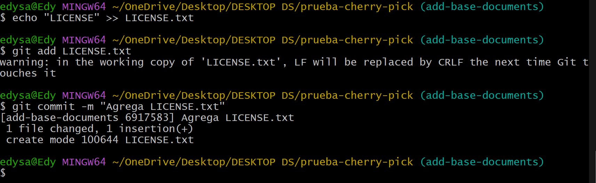
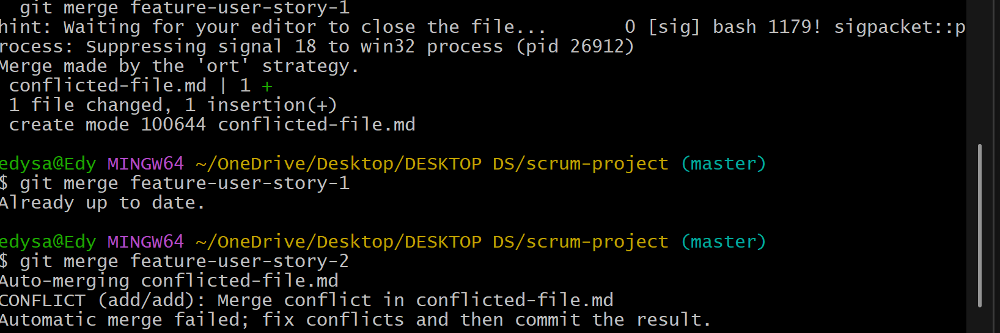
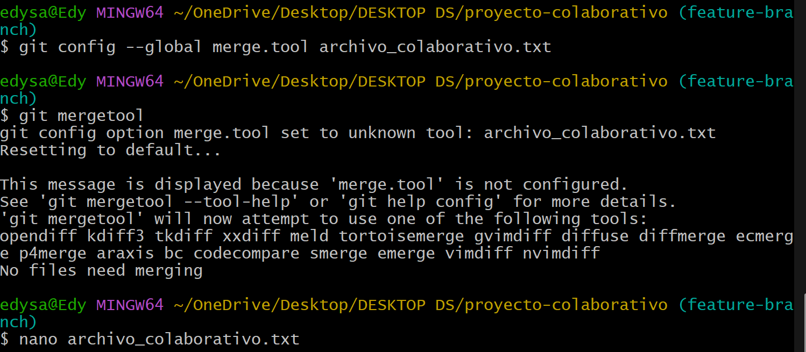

# Actividad 6: Rebase, Cherry-Pick y CI/CD en un entorno ágil

### Parte 1: git rebase para mantener un historial lineal

#### **1. Rebase:** 
El uso de rebase nos facilita tener un historial limpio y lineal, y lo logra al colocar los cambios en la parte superior de las ramas en lugar de solo mostrar un commit con el `merge`.

#### **2. Escenario de ejemplo:**
 * Crea un nuevo repositorio Git y dos ramas, main y new-feature:
    

 * Crea y cambia a la rama new-feature:
    

    Ahora, digamos que se han agregado nuevos commits a main mientras trabajabas en new-feature:
    
    Realizamos el rebase de `new-feature` sobre `master`:
    


#### **3. Revision:**
Después de realizar el rebase, visualiza el historial de commits con:


#### **4. Momento de fusionar y completar el proceso de git rebase:**


### Parte 2: git cherry-pick para la integración selectiva de commit

#### **1. Cherry-pick:** 
Con `cherry pick` podemos seleccionar commit individuales de una rama y aplicarlos a otra.

#### **2. Escenario de ejemplo:**
* Inicializar un nuevo repositorio:

* Agregar y commitear README.md inicial a main:

* Crear y cambiar a una nueva rama 'add-base-documents'

* Hacer cambios y commitearlos y Agregar CONTRIBUTING.md:

* Agregar LICENSE.txt:

* Echa un vistazo al log de la rama 'add-base-documents':


#### **3. Tarea: Haz cherry-pick de un commit de add-base-documents a main:**


#### **4. Revisión:**


#### **Preguntas:**
1.  ¿Por qué se considera que rebase es más útil para mantener un historial de proyecto lineal en comparación con merge?

        Porque rebase reescribe la historia aplicando los commits uno por uno, lo que evita un solo commit al usar merge y se pueda apreciar un historial mas limpio y lineal.


2. ¿Qué problemas potenciales podrían surgir si haces rebase en una rama compartida con otros miembros del equipo?

        Puede causar conflictos ya que reescribe el historial, lo que podria crear confucion y conflicto con otros miembros del equipo.

3. ¿En qué se diferencia cherry-pick de merge, y en qué situaciones preferirías uno sobre el otro?

        Merge une las ramas completas, mientras que cherry-pick copia los commit especificos sin mezclar todo el historial.

4. ¿Por qué es importante evitar hacer rebase en ramas públicas?

        Porque reescribe el historial ya compartido, lo que rompe el flujo de trabajo de otros desarrolladores.

### Ejercicios teoricos

1. **Diferencias entre git merge y git rebase**
**Pregunta:** Explica la diferencia entre git merge y git rebase y describe en qué escenarios sería más adecuado utilizar cada uno en un equipo de desarrollo ágil que sigue las prácticas de Scrum.

        Git merge une ramas creando un commit de merge y git rebase reescribe la historia aplicando commits uno por uno sobre otra base.
        En un escenario donde se quiera mantener el historial completo es mejor usar el merge. Y rebase es mejor usarla en ramas locales para mantener el historial limpio antes de intregrarlo al main


2. **Relación entre git rebase y DevOps**
**Pregunta:** ¿Cómo crees que el uso de git rebase ayuda a mejorar las prácticas de DevOps, especialmente en la implementación continua (CI/CD)? Discute los beneficios de mantener un historial lineal en el contexto de una entrega continua de código y la automatización de pipelines.

        Git rebase nos ayuda a mantener un historial limpio lo que facilita la lectura, el analisis y la automatizacions de pruebas y despliegues en pipelines.
        El beneficio de usar git rebase es que al tener un historial claro, reducen los errores de integracion continua y facilita la deteccion de bugs.


3. **Impacto del git cherry-pick en un equipo Scrum**
**Pregunta:** Un equipo Scrum ha finalizado un sprint, pero durante la integración final a la rama principal (main) descubren que solo algunos commits específicos de la rama de una funcionalidad deben aplicarse a producción. ¿Cómo podría ayudar git cherry-pick en este caso? Explica los beneficios y posibles complicaciones.

        Como solo algunos commit del sprint pueden ir al main, con cherry-pick podemos elegir cuales sin integrar las ramas.
        Beneficio: Cherry-pick controla que cambios se despliegan
        Complicaciones: Podria haber conflicto si los commit seleccionados dependen de otros no incluidos o si por error se aplican varias veces el mismo cambio por diferentes integrantes del equipo.


### Ejercicios practicos:

#### **1. Simulación de un flujo de trabajo Scrum con git rebase y git merge**
* **Contexto:**
Tienes una rama main y una rama feature en la que trabajas. Durante el desarrollo del sprint, se han realizado commits tanto en main como en feature.
Tu objetivo es integrar los cambios de la rama feature en main manteniendo un historial limpio.

##### **Instrucciones:**
* Crea un repositorio y haz algunos commits en la rama main.

* Crea una rama feature, agrega nuevos commits, y luego realiza algunos commits adicionales en main.

* Realiza un rebase de feature sobre main.

* Finalmente, realiza una fusión fast-forward de feature con main.

##### **Preguntas:**
* ¿Qué sucede con el historial de commits después del rebase?

        El historial se reescribe, los commit se aplican uno por uno sobre la nueva base y se les asigna un nuevo bash.

* ¿En qué situación aplicarías una fusión fast-forward en un proyecto ágil?

        Cuando la rama feature esta actualizada respecto al master (main) osea sin commit nuevos en el master desde que se creo la rama, una ventaja esque matiene el historial sin commits de merge innecesarios.

#### **2. Cherry-pick para integración selectiva en un pipeline CI/CD**
* **Contexto:**
Durante el desarrollo de una funcionalidad, te das cuenta de que solo ciertos cambios deben ser integrados en la rama de producción, ya que el resto aún está en desarrollo. Para evitar fusionar toda la rama, decides hacer cherry-pick de los commits que ya están listos para producción.


##### **Instrucciones:**

* Crea un repositorio con una rama main y una rama feature.

* Haz varios commits en la rama feature, pero solo selecciona uno o dos commits específicos que consideres listos para producción.

* Realiza un cherry-pick de esos commits desde feature a main.

* Verifica que los commits cherry-picked aparezcan en main.


##### **Preguntas:**

* ¿Cómo utilizarías cherry-pick en un pipeline de CI/CD para mover solo ciertos cambios listos a producción?

        Podemos usar git cherry-pick <hash> en un pipeline para seleccionar todos los commit validos y listos para produccion desde una rama de desarrollo hacia el master (main).

* ¿Qué ventajas ofrece cherry-pick en un flujo de trabajo de DevOps?

        - Nos permite enviar solo cambios estables a produccion
        - Evita introducir codigo no aprobado
        - Reduce el impacto de cambios grandes al desplegar solo lo necesario


#

## **Git, Scrum y Sprints**

### **Fase 1: Planificación del sprint (sprint planning)**

#### Ejercicio 1: Crear ramas de funcionalidades (feature branches)

En esta fase del sprint, los equipos Scrum deciden qué historias de usuario van a trabajar. Cada historia de usuario puede representarse como una rama de funcionalidad.
Objetivo: Crear ramas para cada historia de usuario y asegurar que el trabajo se mantenga aislado.

##### **Instrucciones:**

* Crea un repositorio en Git.

* Crea una rama main donde estará el código base.

* Crea una rama por cada historia de usuario asignada al sprint, partiendo de la rama main.


##### **Pregunta:** 
¿Por qué es importante trabajar en ramas de funcionalidades separadas durante un sprint?

```
Buenos trabajar en ramas funcionales separadas nos permiten desarrollar y probar cada caracteristica de forma aislada, lo que evita conflictos de los integrantes y facilita el control de versiones y mejora la colaboracion en equipo durante el sprint.
```

### **Fase 2: Desarrollo del sprint (sprint execution)**

#### Ejercicio 1: Integración continua con git rebase

A medida que los desarrolladores trabajan en sus respectivas historias de usuario, pueden ocurrir cambios en main. Para mantener un historial lineal y evitar conflictos más adelante, se usa git rebase para integrar los últimos cambios de main en las ramas de funcionalidad antes de finalizar el sprint.

##### **Instrucciones:**

* Haz algunos commits en main.

* Realiza un rebase de la rama feature-user-story-1 para actualizar su base con los últimos cambios de main.


##### **Pregunta:** 
¿Qué ventajas proporciona el rebase durante el desarrollo de un sprint en términos de integración continua?
```
La ventaja de rebase es que mantiene el historial lineal y limpio lo que facilita la revision de cambios, reduce conflictos al integrar codigo.
```

### **Fase 3: Revisión del sprint (sprint review)**

#### Ejercicio 3: Integración selectiva con git cherry-pick

##### **Instrucciones:**
* Realiza algunos commits en feature-user-story-2.

* Haz cherry-pick de los commits que estén listos para mostrarse a los stakeholders durante la revisión del sprint.


##### **Pregunta:** 
¿Cómo ayuda `git cherry-pick` a mostrar avances de forma selectiva en un sprint review?
```
git cherry-pick nos permite tomar commits especificos de una rama a aplicarlos a otra sin la necesidad de fusionar la rama.
```

### **Fase 4: Retrospectiva del sprint (sprint retrospective)**

#### Ejercicio 4: Revisión de conflictos y resolución

##### **Instrucciones:**
* Realiza cambios en `feature-user-story-1` y `feature-user-story-2` que resulten en conflictos.

* Intenta hacer merge de ambas ramas con main y resuelve los conflictos.





##### **Pregunta:** 

¿Cómo manejas los conflictos de fusión al final de un sprint? ¿Cómo puede el equipo mejorar la comunicación para evitar conflictos grandes?

```
Se resuelven editando manualmente los archivos en conflicto, haciendo git add y luego git commit con una etiqueta que expecifique estos cambios.
Para evitar estos conflictos es necesario coordinar y comunicar avances en reuniones diaria.
```

### **Fase 5: Fase de desarrollo, automatización de integración continua (CI) con git rebase**


#### Ejercicio 5: Automatización de rebase con hooks de Git

##### **Instrucciones:**
* Configura un hook pre-push que haga un rebase automático de la rama main sobre la rama de funcionalidad antes de que el push sea exitoso.

* Prueba el hook haciendo push de algunos cambios en la rama feature-user-story-1.
Comandos:


##### **Pregunta:** 
¿Qué ventajas y desventajas observas al automatizar el rebase en un entorno de CI/CD?

```
Ventajas:

- Mantiene un historial limpio y lineal.

- Reduce conflictos antes del merge.

- Facilita revisiones.

Desventajas:

- Puede sobrescribir historial si no se gestiona bien.

- Riesgo de errores si hay conflictos no resueltos automáticamente.

```


#


## **Navegando conflictos y versionado en un entorno devOps**

### Ejemplo:
#### 1. Inicialización del proyecto y creación de ramas

* Paso 1: Crea un nuevo proyecto en tu máquina local.


* Paso 2: Inicializa Git en tu proyecto.


* Paso 3: Crea un archivo de texto llamado `archivo_colaborativo.txt` y agrega algún contenido inicial.


* Paso 4: Agrega el archivo al área de staging y haz el primer commit.


* Paso 5: Crea dos ramas activas: main y feature-branch.


* Paso 6: Haz checkout a la rama feature-branch y realiza un cambio en el archivo archivo_colaborativo.txt.


* Paso 7: Regresa a la rama main y realiza otro cambio en la misma línea del archivo archivo_colaborativo.txt.


#### 2. Fusión y resolución de conflictos

* Paso 1: Intenta fusionar feature-branch en main. Se espera que surjan conflictos de fusión.


* Paso 2: Usa `git status` para identificar los archivos en conflicto. Examina los archivos afectados y resuelve manualmente los conflictos, conservando las líneas de código más relevantes para el proyecto.


* Paso 3: Una vez resueltos los conflictos, commitea los archivos y termina la fusión


#### 3. Simulación de fusiones y uso de git diff

* Paso 1: Simula una fusión usando `git merge --no-commit --no-ff` para ver cómo se comportarían los cambios antes de realizar el commit.


#### 4. Uso de git mergetool

* Paso 1: Configura git mergetool con una herramienta de fusión visual (puedes usar meld, vimdiff, o Visual Studio Code) Y usa la herramienta gráfica para resolver un conflicto de fusión.



#### 5. Uso de git revert y git reset

* Paso 1: Simula la necesidad de revertir un commit en main debido a un error. Usa `git revert` para crear un commit que deshaga los cambios.


* Paso 2: Realiza una prueba con `git reset --mixed` para entender cómo reestructurar el historial de commits sin perder los cambios no commiteados.


#### 6. Versionado semántico y etiquetado

* Paso 1: Aplica versionado semántico al proyecto utilizando tags para marcar versiones importantes.


#### 7. Aplicación de git bisect para depuración

* Paso 1: Usa git bisect para identificar el commit que introdujo un error en el código.


### Preguntas:

#### 1. Ejercicio para git checkout --ours y git checkout --theirs
**Contexto:** En un sprint ágil, dos equipos están trabajando en diferentes ramas. Se produce un conflicto de fusión en un archivo de configuración crucial. El equipo A quiere mantener sus cambios mientras el equipo B solo quiere conservar los suyos. El proceso de entrega continua está detenido debido a este conflicto.

**Pregunta:**
¿Cómo utilizarías los comandos `git checkout --ours` y `git checkout --theirs` para resolver este conflicto de manera rápida y eficiente? Explica cuándo preferirías usar cada uno de estos comandos y cómo impacta en la pipeline de CI/CD. ¿Cómo te asegurarías de que la resolución elegida no comprometa la calidad del código?

```
Si el equipo A quiere conservar sus cambios usaria "git checkout --ours archivo.conf" y el equipo B "git checkout --theirs archivo.conf" y asi se resuelve los conflictos de manera rapida sin editar manualmente lo qu eno spermite no detener el pipeline
```

#### 2. Ejercicio para git diff

**Contexto:** Durante una revisión de código en un entorno ágil, se observa que un pull request tiene una gran cantidad de cambios, muchos de los cuales no están relacionados con la funcionalidad principal. Estos cambios podrían generar conflictos con otras ramas en la pipeline de CI/CD.

**Pregunta:**
Utilizando el comando `git diff`, ¿cómo compararías los cambios entre ramas para identificar diferencias específicas en archivos críticos? Explica cómo podrías utilizar `git diff feature-branch..main` para detectar posibles conflictos antes de realizar una fusión y cómo esto contribuye a mantener la estabilidad en un entorno ágil con CI/CD.


```
Al usar "git diff" muestra diferencias en archivos importantes y puedo detectar cambios innecesarios o posibles conflictos antes de hacer el merge, lo que evita errores en la pipeline y mantiene estable el proyecto.
```


#### 3. Ejercicio para git merge --no-commit --no-ff

**Contexto:** En un proyecto ágil con CI/CD, tu equipo quiere simular una fusión entre una rama de desarrollo y la rama principal para ver cómo se comporta el código sin comprometerlo inmediatamente en el repositorio. Esto es útil para identificar posibles problemas antes de completar la fusión.

**Pregunta:**
Describe cómo usarías el comando `git merge --no-commit --no-ff` para simular una fusión en tu rama local. ¿Qué ventajas tiene esta práctica en un flujo de trabajo ágil con CI/CD, y cómo ayuda a minimizar errores antes de hacer commits definitivos? ¿Cómo automatizarías este paso dentro de una pipeline CI/CD?

```
Con este comando me permite ver si hay conflictos o errores sin comprometer cambios.
Y para automatizarlo, lo integraría en la pipeline como una validación previa al merge final para evitar errores en producción.
```

#### 4. Ejercicio para git mergetool

**Contexto:** Tu equipo de desarrollo utiliza herramientas gráficas para resolver conflictos de manera colaborativa. Algunos desarrolladores prefieren herramientas como vimdiff o Visual Studio Code. En medio de un sprint, varios archivos están en conflicto y los desarrolladores prefieren trabajar en un entorno visual para resolverlos.

**Pregunta:**
Explica cómo configurarías y utilizarías git mergetool en tu equipo para integrar herramientas gráficas que faciliten la resolución de conflictos. ¿Qué impacto tiene el uso de `git mergetool` en un entorno de trabajo ágil con CI/CD, y cómo aseguras que todos los miembros del equipo mantengan consistencia en las resoluciones?

```
Ayuda a que todo el equipo resuelva conflictos visualmente de forma clara y rápida.
```

#### 5. Ejercicio para git reset

**Contexto:** En un proyecto ágil, un desarrollador ha hecho un commit que rompe la pipeline de CI/CD. Se debe revertir el commit, pero se necesita hacerlo de manera que se mantenga el código en el directorio de trabajo sin deshacer los cambios.

**Pregunta:**
Explica las diferencias entre `git reset --soft`, `git reset --mixed` y `git reset --hard`. ¿En qué escenarios dentro de un flujo de trabajo ágil con CI/CD utilizarías cada uno? Describe un caso en el que usarías `git reset --mixed` para corregir un commit sin perder los cambios no commiteados y cómo afecta esto a la pipeline.

```
--soft: Revierte el commit pero mantiene todo en staging.

--mixed: Quita del staging pero deja los archivos en el directorio.

--hard: Borra todo, staging y archivos.
```

#### 6. Ejercicio para git revert

**Contexto:** En un entorno de CI/CD, tu equipo ha desplegado una característica a producción, pero se ha detectado un bug crítico. La rama principal debe revertirse para restaurar la estabilidad, pero no puedes modificar el historial de commits debido a las políticas del equipo.

**Pregunta:**
Explica cómo utilizarías `git revert` para deshacer los cambios sin modificar el historial de commits. ¿Cómo te aseguras de que esta acción no afecte la pipeline de CI/CD y permita una rápida recuperación del sistema? Proporciona un ejemplo detallado de cómo revertirías varios commits consecutivos.
```
La pipeline no se rompe porque el historial se mantiene y el sistema vuelve a un estado estable sin problemas.
```

#### 7. Ejercicio para git stash

**Contexto:** En un entorno ágil, tu equipo está trabajando en una corrección de errores urgente mientras tienes cambios no guardados en tu directorio de trabajo que aún no están listos para ser committeados. Sin embargo, necesitas cambiar rápidamente a una rama de hotfix para trabajar en la corrección.

**Pregunta:**
Explica cómo utilizarías `git stash` para guardar temporalmente tus cambios y volver a ellos después de haber terminado el hotfix. ¿Qué impacto tiene el uso de `git stash` en un flujo de trabajo ágil con CI/CD cuando trabajas en múltiples tareas? ¿Cómo podrías automatizar el proceso de stashing dentro de una pipeline CI/CD?

```
Impacto: Me permite cambiar de tarea rápido sin perder mis cambios.
```
```
Automatización: Podría hacer que la pipeline detecte stashes y los guarde temporalmente si hay cambios locales sin guardar.
```

#### 8. Ejercicio para .gitignore

**Contexto:** Tu equipo de desarrollo ágil está trabajando en varios entornos locales con configuraciones diferentes (archivos de logs, configuraciones personales). Estos archivos no deberían ser parte del control de versiones para evitar confusiones en la pipeline de CI/CD.

**Pregunta:**
Diseña un archivo `.gitignore` que excluya archivos innecesarios en un entorno ágil de desarrollo. Explica por qué es importante mantener este archivo actualizado en un equipo colaborativo que utiliza CI/CD y cómo afecta la calidad y limpieza del código compartido en el repositorio.

```
Respecto a la importavcia esto evita que archivos locales o temporales pasen al repositorio, lo que mantiene el código limpio y estable para la CI/CD.
En colaboración si todo el equipo usa el mismo .gitignore evitamos errores por configuraciones distintas.
```

### Ejercicios adicionales

#### Ejercicio 1: Resolución de conflictos en un entorno ágil

**Contexto:**
Estás trabajando en un proyecto ágil donde múltiples desarrolladores están enviando cambios a la rama principal cada día. Durante una integración continua, se detectan conflictos de fusión entre las ramas de dos equipos que están trabajando en dos funcionalidades críticas. Ambos equipos han modificado el mismo archivo de configuración del proyecto.

**Pregunta:**
¿Cómo gestionarías la resolución de este conflicto de manera eficiente utilizando Git y manteniendo la entrega continua sin interrupciones? ¿Qué pasos seguirías para minimizar el impacto en la CI/CD y asegurar que el código final sea estable?

        
 Para este tipo de problemas seguiria estos pasos:

1. Identifico los archivos en conflicto con `git status`.

2. Uso `git diff` para ver exactamente que cambio cada equipo.

3. Cordinacion con los equipos para hablar de los cambios necesarios.

4. Resuelvo manualmente el conflicto, o uso `git checkout --ours o --theirs` si es evidente.

5. Pruebo localmente con los tests .

6. Hago `git add` de los archivos corregidos y `git commit`.

Y para minimizar el impacto en CI/CD hacemos una integracion frecuente y no esperar al final del sprint, tambien seria util comunicarse con los equipos para saber que archivos tocar y evitar solapamientos.


#### Ejercicio 2: Rebase vs. Merge en integraciones ágiles

**Contexto:**
En tu equipo de desarrollo ágil, cada sprint incluye la integración de varias ramas de características. Algunos miembros del equipo prefieren realizar merge para mantener el historial completo de commits, mientras que otros prefieren rebase para mantener un historial lineal.

**Pregunta:**
¿Qué ventajas y desventajas presenta cada enfoque (merge vs. rebase) en el contexto de la metodología ágil? ¿Cómo impacta esto en la revisión de código, CI/CD, y en la identificación rápida de errores?

* **Merge:**
- Ventajas: Historial completo ya que se puede ver como se integro cada rama.
- Desventajas: Dificil de seguir el orden de desarrollo debido al desorden al integrar las ramas


* **Rebase:**
- Ventajas: Historial limpio y facil de leer
- Desventajas: Al aplicarlo mal puede sobreescribir el historial por lo tanto es una herramienta muy delicada en colaboracion


* **Impacto en agil y CI/CD:**
- Rebase brinda una revision rapida y clara.

- Merge es mejor si se prioriza la trazabilidad

- Para evitar los conflictos y usar ambas herramientas de mejor manera se usaria rebase en ramas personales y merge en ramas compartidas.

#### Ejercicio 3: Git Hooks en un flujo de trabajo CI/CD ágil

**Contexto:**
Tu equipo está utilizando Git y una pipeline de CI/CD que incluye tests unitarios, integración continua y despliegues automatizados. Sin embargo, algunos desarrolladores accidentalmente comiten código que no pasa los tests locales o no sigue las convenciones de estilo definidas por el equipo.

**Pregunta:**
Diseña un conjunto de Git Hooks que ayudaría a mitigar estos problemas, integrando validaciones de estilo y tests automáticos antes de permitir los commits. Explica qué tipo de validaciones implementarías y cómo se relaciona esto con la calidad del código y la entrega continua en un entorno ágil.
 
 ```
 En este caso usaria `pre-commit` el cual corre test basicos y `commit-msg` que verifica el formato del mensaje y con esto podemos asegrurar que lo que llega al repositorio ya esta validado. En relacion con el entorno Agil es que evita que la pipeline falle y mantiene un codigo mas consistente.
```

#### Ejercicio 4: Estrategias de branching en metodologías ágiles

**Contexto:**
Tu equipo de desarrollo sigue una metodología ágil y está utilizando Git Flow para gestionar el ciclo de vida de las ramas. Sin embargo, a medida que el equipo ha crecido, la gestión de las ramas se ha vuelto más compleja, lo que ha provocado retrasos en la integración y conflictos de fusión frecuentes.

**Pregunta:**
Explica cómo adaptarías o modificarías la estrategia de branching para optimizar el flujo de trabajo del equipo en un entorno ágil y con integración continua. Considera cómo podrías integrar feature branches, release branches y hotfix branches de manera que apoyen la entrega continua y minimicen conflictos.

En ese caso buscaria simplificar Git Flow y las ramas serian:

- main: producción.

- develop: rama base de desarrollo.

- feature/*: ramas cortas, integradas cada 1-2 días.

- release/*: solo si hay una versión que preparar.

- hotfix/*: para bugs urgentes en producción.

Con esto buscamos fusiones pequeñas y frecuentes, y asi minimizar el tiempo de vida de las ramas.

#### Ejercicio 5: Automatización de reversiones con git en CI/CD

**Contexto:**
Durante una integración continua en tu pipeline de CI/CD, se detecta un bug crítico después de haber fusionado varios commits a la rama principal. El equipo necesita revertir los cambios rápidamente para mantener la estabilidad del sistema.

**Pregunta:**
¿Cómo diseñarías un proceso automatizado con Git y CI/CD que permita revertir cambios de manera eficiente y segura? Describe cómo podrías integrar comandos como git revert o git reset en la pipeline y cuáles serían los pasos para garantizar que los bugs se reviertan sin afectar el desarrollo en curso.

El diseño seria el siguiente.
Primero la pipeline detecta errores y si el error viene de uno o mas commits, luego con `git revert <hash1> <hash2>` hacemos una automatizacion como `revert-auto/*`, luego se testea y se despliega.
