# Actividad 8: El patrón Arrange-Act-Assert

## Ejercicios:
### Ejercicio 1: Método para vaciar el carrito
Implementa en la clase Carrito un método llamado vaciar() que elimine todos los items del carrito. 
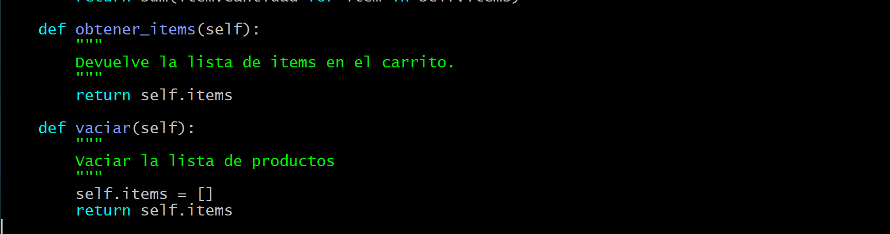

Luego, escribe pruebas siguiendo el patrón AAA para verificar que, al vaciar el carrito, la lista de items quede vacía y el total sea 0.
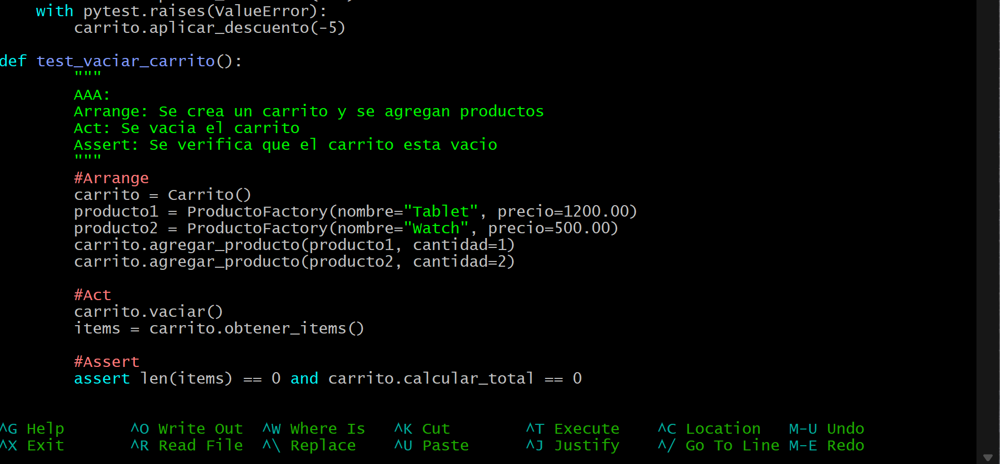

Testeo:

### Ejercicio 2: Descuento por compra mínima

Amplía la lógica del carrito para aplicar un descuento solo si el total supera un monto determinado. Por ejemplo, si el total es mayor a $500, se aplica un 15% de descuento.
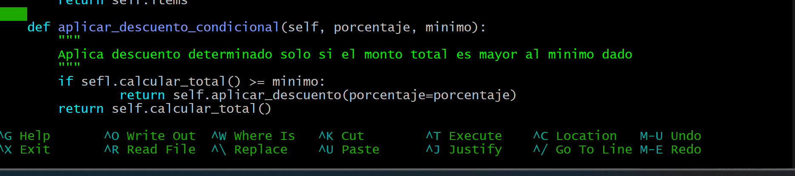

Sus pruebas unitarias:
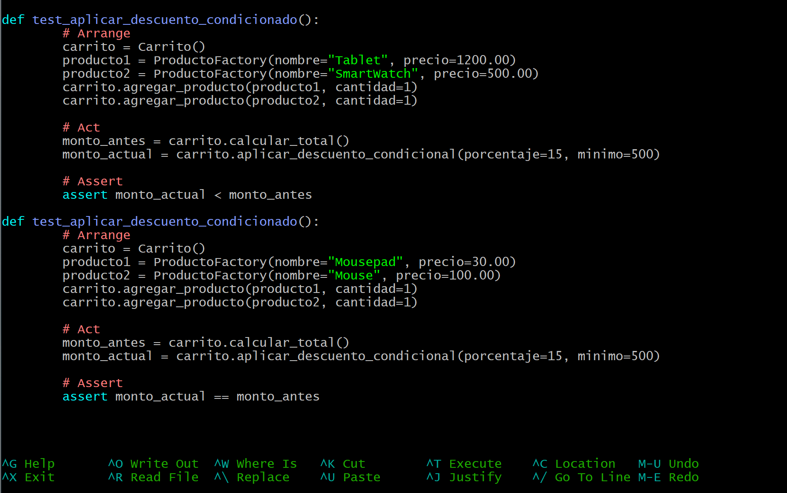

### Ejercicio 3: Manejo de stock en producto
Modifica la clase Producto para que incluya un atributo stock (cantidad disponible). 
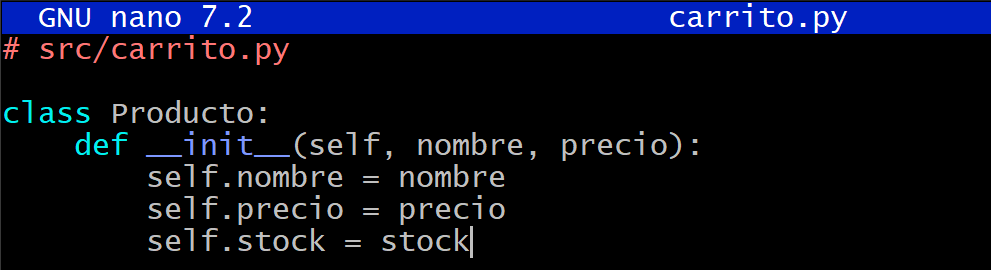
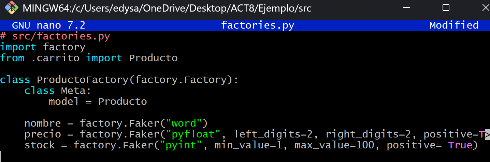

Luego, actualiza el método agregar_producto en Carrito para que verifique que no se agregue una cantidad mayor a la disponible en stock. Si se intenta agregar más, se debe lanzar una excepción.
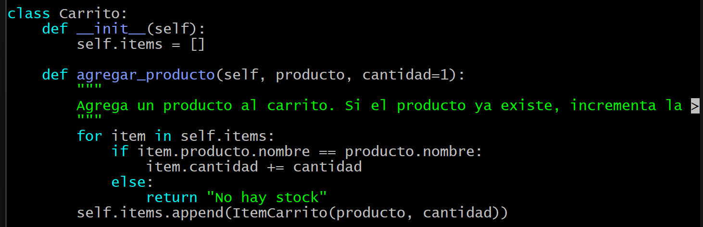

Sus pruebas unitarias:
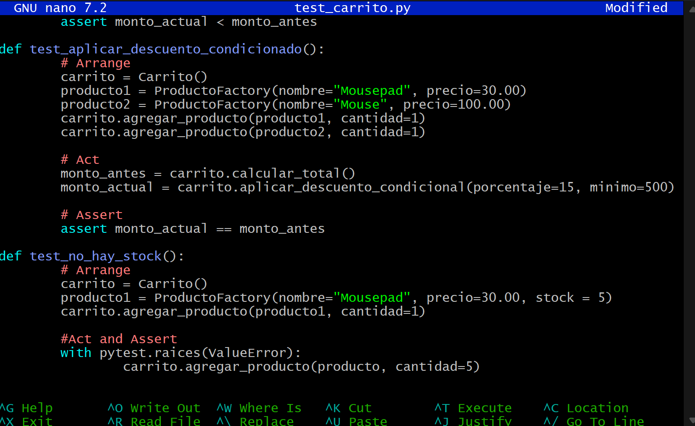

### Ejercicio 4: Ordenar items del carrito
Agrega un método en Carrito que devuelva la lista de items ordenados por un criterio (por ejemplo, por precio unitario o por nombre del producto).
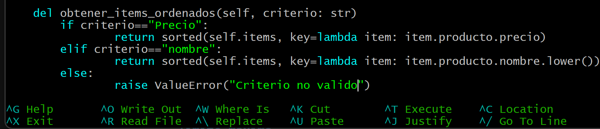

Sus pruebas unitarias:
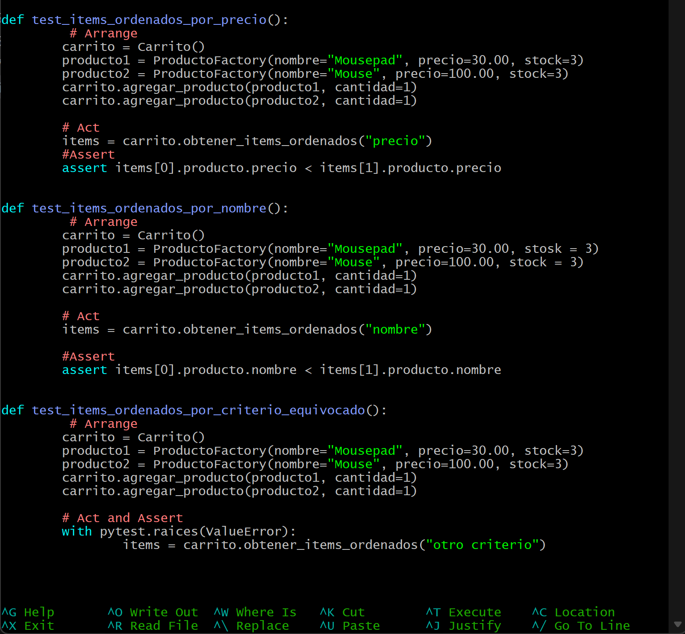

### Ejercicio 5: Uso de Pytest Fixtures
Refactoriza las pruebas para que utilicen fixtures de Pytest, de modo que se reutilicen instancias comunes de Carrito o de productos.
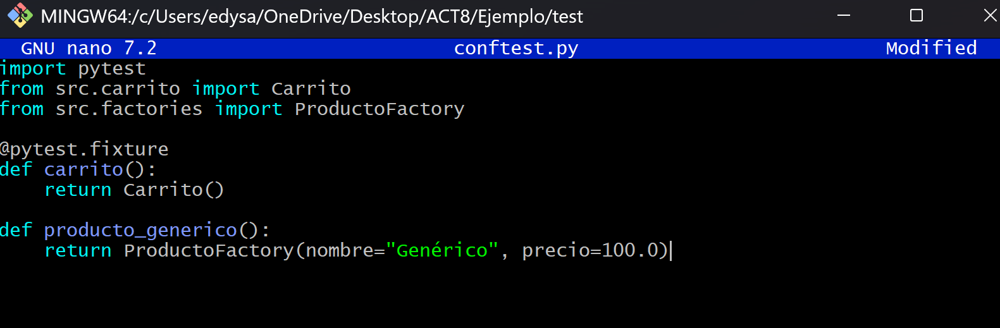

### Ejercicio 6: Pruebas parametrizadas
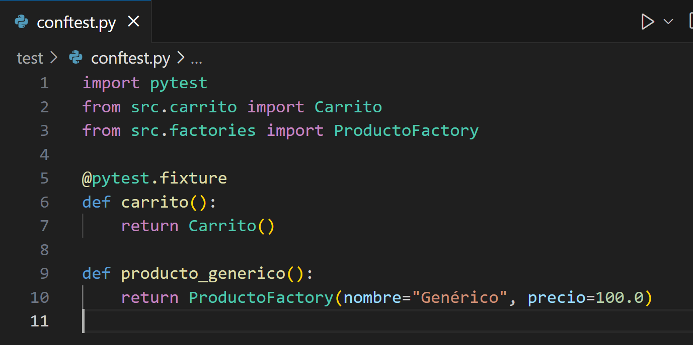
#
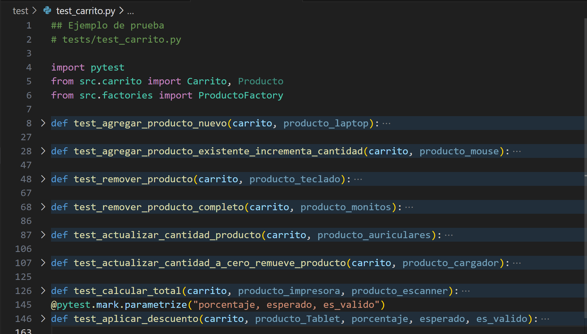

