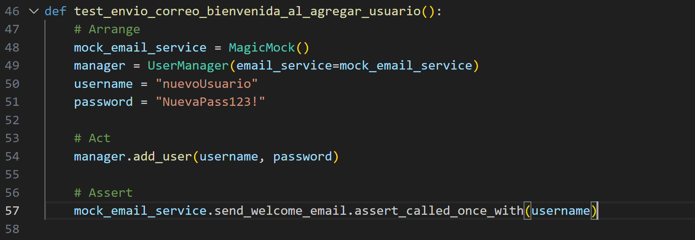

# Actividad: Red-Green-Refactor
En esta actividad buscaremos desarrollar una clase ShoppingCart que permita gestionar un carrito de compras.

## Ejercicio
Desarrollaremos las 6 iteraciones de Desarrollo Guiado por pruebas (TDD)(Res-Green-Refactor) aplicadas a la clase `UserManager`.
#### Iteracion 1: Agregar usuario (Básico)
###### Paso 1 (Red): Escribimos la primera prueba
Creamos la prueba que verifica que podemos agregar un usuario con éxito.
Archivo: `tests/test_user_manager.py`

Ejecutamos `pytest`.

El error se debe a que no implementamos `user_manager.py`
###### Paso 2 (Green): Implementamos lo mínimo para que pase la prueba
Archivo: `user_manager.py`

###### Paso 3 (Refactor):
Revisamos que el código sea claro y conciso. Por ahora, el diseño es simple y cumple su función.

Ahora se ejecuta correctamente.

#### Iteracion 2: Autenticación de usuario (Introducción de una dependencia para Hashing)
Ahora queremos asegurar contraseñas usando hashing. 
###### Paso 1 (Red):
Queremos verificar que UserManager autentica correctamente a un usuario con la contraseña adecuada.

###### Paso 2 (Green):
Modificamos user_manager.py para inyectarle un servicio de hashing:

###### Paso 3 (Refactor):
Podemos refactorizar si lo consideramos necesario, pero por ahora la estructura cumple el propósito pasando el testing.

#### Iteracion 3: Uso de un Mock para verificar llamadas (Spy / Mock)
Ahora queremos asegurarnos de que, cada vez que llamamos a add_user, se invoque el método hash de nuestro servicio de hashing.

###### Paso 1 (Red):Escribimos la prueba de "espionaje"
Instalaremos e importaremos `unittest.mock` para crear un mock:

###### Paso 2 (Green): Probar que todo pasa
Realmente, nuestro código ya llama a `hash_service.hash`. Si ejecutamos `pytest`, la prueba debería pasar de inmediato.

###### Paso 3 (Refactor):

No hay cambios adicionales. El uso de Mocks/Spies simplemente corrobora el comportamiento interno.

#### Iteracion 4: Excepción al agregar usuario existente (Stubs/más pruebas negativas)
En esta iteración, reforzamos la prueba para el caso de usuario duplicado.

###### Paso 1 (Red): Prueba

###### Paso 2 (Green)

###### Paso 3 (Refactor)

Nada adicional por el momento.

#### Iteracion 5: Agregar un "Fake" repositorio de datos (Inyección de Dependencias)
Hasta ahora, U`serManager` guarda los usuarios en un diccionario interno (`self.users`).
Ahora queremos que se usa base de datos en produccio, pero en pruebas se usa la memoria del repositorio.

###### Paso 1 (Red):Nueva prueba
Creamos una prueba que verifique que podemos inyectar un repositorio y que `UserManager` lo use.

###### Paso 2 (Green): Implementación
Modificamos `UserManager` para recibir un `repo`:

###### Paso 3 (Refactor):
El código quedó un poco más ordenado; `UserManager` no depende directamente de la estructura interna de almacenamiento.

#### Iteracion 6: Introducir un “Spy” de notificaciones (Envío de correo)
Finalmente, agregaremos una funcionalidad que, cada vez que se agrega un usuario, se envíe un correo de bienvenida. 

###### Paso 1 (Red): Prueba

Debe salir error debido a que `UserManager` no llama a ningun `send_welcome_email`.

###### Paso 2 (Green): Implementamos la llamada al servicio de correo

Encontramos algunos errores en el test, tuve que modificar 

Testeamos con `pytest`:

###### Paso 3 (Refactor):

Podríamos refactorizar lo que queramos, pero la lógica principal es clara: si se inyecta `email_service`, se usa; si no, no se hace nada especial.