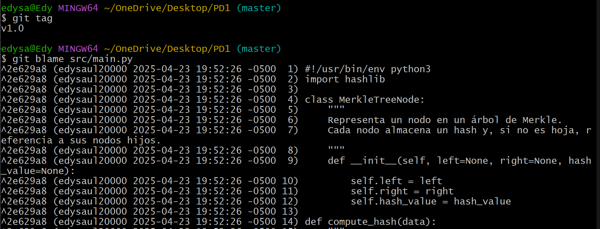
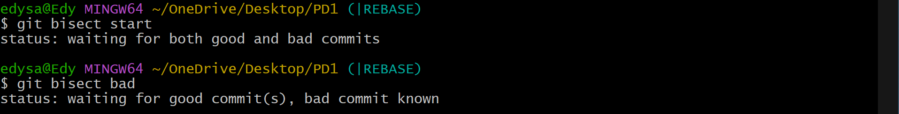

# Actividad: Exploración avanzada de Git y estructuras de datos (árbol de Merkle)

### Paso 1: Configuración inicial y preparación del entorno

* Descargamos y guardamos el script completo llamado `git_workflow.sh` en un directorio de trabajo.

* Otorgamos los permisos de ejecución al script con  el comando:
```
chmod +x git_workflow.sh
```
Ahora vamos a desarrollar los ejercicios:

#### Ejercicio 1: Configuración inicial y clonación de repositorios

* Ejecuta el script y observa cómo se inicializa el repositorio con git init.


* Si se ha pasado una URL de clonación, verifica la creación del directorio repo_clonado.


### Paso 2: Generación de la estructura del proyecto y primer Commit

* El script crea automáticamente los directorios `src`, `tests` y `docs`, además de generar un archivo `.gitignore`.


* En el archivo `src/main.py` se encuentra la implementación avanzada del árbol de Merkle; repasa el código para identificar la clase `MerkleTreeNode` y las funciones `compute_hash`, `build_merkle_tree` y `print_tree`.


* Revisando el historial con `git log --oneline`.


#### Ejercicio 2: Estructuración y commit inicial

* Revisa el contenido del archivo `docs/README.md` y confirma que la documentación básica está presente.


### Paso 3: Manejo de cambios y uso de stash

* El script simula la modificación de `src/main.py` agregando una línea adicional.
* Utiliza el comando `git diff` que se muestra en pantalla para examinar las diferencias.
* La actividad te invita a ejecutar el stash y luego a restaurar los cambios para comprender el flujo:

```python
git stash push -m "Cambio en main.py para pruebas de stash"
git stash pop
```
#### Ejercicio 3: Comparación de versiones y uso de stash 

* Modifique el archivo manualmente añadiendo "New message" y ejecute `git diff` para notar cómo se detectan los cambios.


* Luego experimente con `git stash`.


### Paso 4: Inspección del historial y análisis de cambios

* Ejecuta las funciones que crean etiquetas (`git tag`) y utiliza `git blame` para observar quién ha modificado las líneas en `src/main.py`.


* Revisa el historial gráfico con `git log --graph --decorate --oneline` para entender la estructura de ramas y merges.


#### Ejercicio 4: Inspección y análisis del historial

* Analiza la salida de `git blame` para identificar partes clave del código del árbol de Merkle.
```
Al ejecutar el git blame busco las funciones como construir_argol_merkle().
Tambiem en la parte izquierda se visualiza quien y cuando hizo los cambios.
```

* Toma nota de cómo la estructura del historial puede ayudar a rastrear cambios significativos.
```
Con esta funcion pude vizualizar en que rama se introdujo las funciones del arbol de merkle y tambien identifica si hubo merges desde otras ramas.
```


### Paso 5: Deshacer cambios y experimentar con reset

* La actividad propone deshacer un commit erróneo utilizando `git revert`.


Ahora usamos el `git revert`


* Se crea y elimina un archivo temporal con `git rm `para comprender cómo se gestionan los cambios en el repositorio.


* En una rama de prueba se ejecuta `git reset` en sus diferentes variantes (soft, mixed y hard).

Lo vamos a realizar en una rama llamada prueba-reset.

#### Ejercicio 5: Deshacer cambios y reset

* Realiza un commit manualmente, luego usa `git revert` para deshacerlo.


* Crea una rama temporal, haz cambios y experimenta con los distintos modos de `git reset` para observar los efectos en el área de staging y en el directorio de trabajo.


### Paso 6. Reescritura del historial con rebase interactivo y uso de reflog

* El script muestra instrucciones para iniciar un `git rebase -i` (rebase interactivo) y visualiza el `git reflog` para que veas el historial de movimientos de HEAD.

* Se recomienda ejecutar la instrucción de rebase manualmente en un entorno de prueba.

#### Ejercicio 6: Rebase interactivo y reflog

* Prepara al menos tres commits.


* Ejecutamos el comando `git rebase -i HEAD~3`.


* Consulta el `git reflog` para entender cómo se registran los cambios de punteros en el repositorio.


### Paso 7. Sincronización de repositorios remotos

* Aunque se usa una URL de ejemplo, en esta actividad se simula la sincronización remota mediante `git remote add`, `git fetch` y `git pull`.


#### Ejercicio 7: Sincronización de repositorios

* Agrega manualmente un remoto y verifica la comunicación entre el repositorio local y el remoto.

Al verificar me salio error debido a que solo estoy usando un repositorio local y no en Github.

* Simula la resolución de conflictos si modificas manualmente un mismo archivo en dos ramas diferentes.

Aqui me salio error por `conflicto`, necesitamos eliminar los simbolos (<<<<, ========) manualmente.

Una vez arreglados hacemos el commit con su descripcion.


### Paso 8. Estrategias avanzadas de branching y merging

* El script crea ramas para nuevas funcionalidades y hotfixes.

* Se ejecuta un merge sin fast-forward y luego un octopus merge para unir varias ramas simultáneamente.

* Revisa el historial con `git log --graph` para observar la estructura de merges.

#### Ejercicio 8: Branching y merging avanzado

* Crea tus propias ramas (p. ej., `feature-A`, `hotfix-B`) y prueba diferentes estrategias de merge.

Ahora probamos el Merge con `--ff` y `--no-ff` (fast-forward)


Ahora creamos otra rama para probar con otro tipo de merge

Ahora probamos el Merge con `--squash`


* Documenta los resultados y discute las ventajas de cada técnica.


**Ventajas para `--ff` :** Hace el historial mas lineal sin commits de merge innecesarios para que se vea mas claro.

**Ventajas para `--no-ff` :** Mantiene el historial completo y tambien de cuando se fusiono una rama.

**Ventajas para `--squash` :** Agrupa commits en uno solo, se tendra un historial mas limpio.

### Paso 9. Uso de git bisect para identificar errores

* Se introduce intencionadamente un error en `src/main.py` para que practiques con `git bisect`.

* Sigue el proceso de bisect asignando un commit “bueno” y uno “malo” para identificar el cambio que introdujo el error.


#### Ejercicio 9: Localización de errores con bisect

* Ejecutamos los comandos de bisect y marcamos commit bueno y commit malo para determinar en que commit se introdujo el bug.



* Finalizamos la sesión de bisect con `git bisect reset`.

Con el `git bisect reset ` regresamos al estado anterios del bisect osea el HEAD original.

### Paso 10. Gestión de submódulos y configuración de hooks

* Agrega un submódulo utilizando el comando `git submodule add` y verifica su funcionamiento.

* Configura un hook pre-commit que, al realizar un commit, muestre un mensaje o ejecute una comprobación de formato de código.


#### Ejercicio 10: Submódulos y hooks

* Implementa la configuración del submódulo y realiza pruebas para asegurarte de que se integre correctamente.
    Primero creamos un proyecto principal con:
    ```
    mkdir proyecto-principal && cd proyecto-principal
    git init
    ```
    Luego agregamos un submodulo como otro repo de Github
    y creamos un subdirectorio `lib` con el submodulo.
    ```
    git submodule add "link del repositorio" lib
    ```
    Luego realizamos el commit.

* Valida la ejecución del hook haciendo un commit y observando el mensaje de verificación.

    Aqui cremos un archivo `.git/hooks/pre-commit` para la verificacion pero antes debemos darle los permisos con `chmod +x .git/hooks/pre-commit`, despues hacemos un commit creando un archivo y nos aparecera el mensaje guardado en en el archivo hooks.

**Conclusion:**
Bueno con los Submodulos podemos incluir un repositorio dentro de otro y con Hook hacer scripts automaticos que se ejecutan en eventos como commis o push.

### Paso 11. Limpieza del historial y creación de worktrees

* El script incluye una sección que simula la limpieza del historial (con `git filter-branch` o BFG Repo-Cleaner) y la creación de un Git Worktree.

* Utiliza la funcionalidad de worktree para trabajar en una rama de forma aislada sin afectar el repositorio principal.


#### Ejercicio 11: Historial y worktrees

* Simula la limpieza del historial siguiendo las indicaciones.
 ```
 Al usar git filter-branch podria reescribir el historial, por lo tanto tenemos que usarlo con precaucion. 
 ```


### Paso 12. Implementación y prueba del árbol de Merkle

* Analiza el contenido del archivo `src/main.py`, revisando cómo se implementa la estructura de un árbol de Merkle.

* Ejecuta el script Python para ver el árbol construido a partir de datos de ejemplo y examina el hash de la raíz y la estructura completa.

* Ejecuta los tests unitarios ubicados en `tests/test_main.py` para validar el correcto funcionamiento del árbol.


#### Ejercicio 12: Árbol de Merkle

* Ejecuta el siguiente comando en la terminal:
```python
python3 src/main.py
```


y observamos la salida que muestra el hash de la raíz y la estructura jerárquica del árbol.

* Ejecuta las pruebas unitarias con:
```python
python3 -m unittest discover tests
```


Esto nos indica que la prueba de verificacion del `hash`, construccion de nosos y consistecia del arbol han pasado la consistencia del arbol.


#### Ejercicio 13: Verificación extendida de pruebas de Merkle

* Añade en `merkletree.py` una nueva función que reciba un proof generado por request_proof y el elemento original, y que verifique de forma recursiva si la prueba reconstruye correctamente el hash de la raíz.


* Modifica `test_merkletree.py` para incluir casos de prueba donde se compare el resultado de la verificación ante cambios menores en el proof, comprobando que se detectan inconsistencias.


