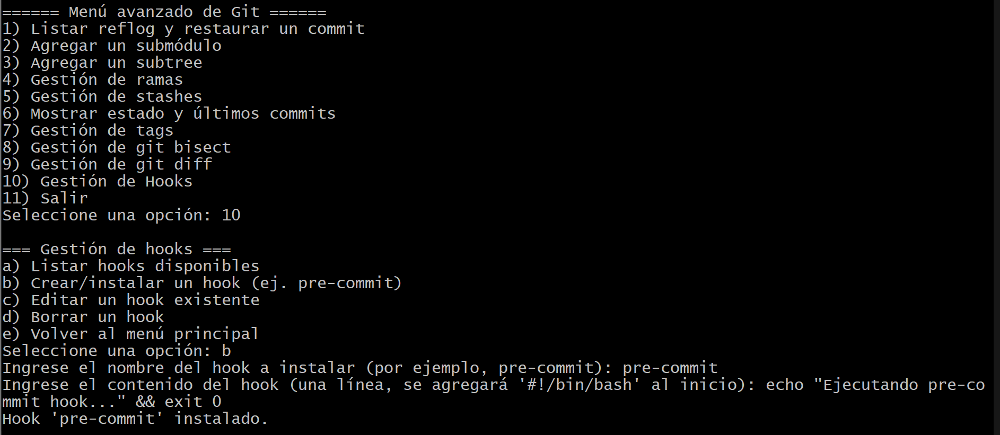

# Actividad: Exploración y administración avanzada de Git mediante un script interactivo

## Instrucciones previas
1. Descarga y guarda el script:

    * Copia el contenido del script proporcionado (el ejemplo extendido) y guárdalo en un archivo llamado git_avanzado.sh.


2. Asignar permisos de ejecución:

    * Abre la terminal en el directorio donde guardaste el archivo y ejecuta: `chmod +x git_avanzado.sh`


3. Ubicación:

    * Asegúrate de ejecutar el script dentro de la raíz de un repositorio Git, ya que el script interactúa con el entorno Git.


### Procedimiento de la actividad
1. **Inicio del script**


2. **Opción: agregar un submódulo (Opción 2)**


3. **Opción: Gestión de ramas (Opción 4)**


4. **Opción: Gestión de git diff (Opción 9)**


5. **Opción: Gestión de hooks (Opción 10)**


6. **Finalizar la sesión**


### Preguntas:
* ¿Qué diferencias observas en el historial del repositorio después de restaurar un commit mediante reflog?
```
Lo que observe es que el HEAD se mueve a un estado anterior del repositorio, creando un nuevo commit si se hace cambios desde alli, tambien es importante mencionar que el historial puede parecer alterado pero no se pierde informacion.
```

* ¿Cuáles son las ventajas y desventajas de utilizar submódulos en comparación con subtrees?
```
La ventaja de los Submodulos es que separan los proyectos y se  mantiene el historial pero es mas complejo de manejar. Y para Subtrees la ventaja seria que es mas sencillo de utilizar pero la desventaja es que el historial del subproyecto puede mezclarse.
```

* ¿Cómo impacta la creación y gestión de hooks en el flujo de trabajo y la calidad del código?
```
Automatiza tareas como validaciones antes de commits evitando errores, mejora la calidad de codigo aunque puede generar conflictos si no estan bien documentaods o sincronisados entre colaboradores.
```

* ¿De qué manera el uso de git bisect puede acelerar la localización de un error introducido recientemente?
```
Nos ayuda a encontrar el commit que introdujo el error usando la busqueda binaria lo que reduce el numero de revisiones.
```

* ¿Qué desafíos podrías enfrentar al administrar ramas y stashes en un proyecto con múltiples colaboradores?
```
Podriamos tener problemas al fusionar ramas, perdidas de cambios no aplicados y a esto sumarle la fusion de ramas desactualizadas podria ocacionar perdidas de tiempo en corregirlo para hacerlo de manera adecuada.
```


## Ejercicios

### 1. Extiende el menú de gestión de ramas para incluir la funcionalidad de renombrar ramas.

**Instrucciones:**

1. Investiga el comando git branch -m que permite renombrar una rama.
2. Modifica la función de "Gestión de ramas" para agregar una nueva opción (por ejemplo, "f) Renombrar una rama".
3. Implementa la lógica para solicitar al usuario el nombre de la rama actual y el nuevo nombre.
4. Verifica que, tras el cambio, la rama se renombre correctamente.

**Pista:** Considera cómo se comporta el cambio si la rama en uso es la que se desea renombrar.


### 2. Amplia la sección de "Gestión de git diff" para permitir ver las diferencias de un archivo específico entre dos commits o ramas.

**Instrucciones:**

1. Investiga cómo usar `git diff `con la opción `--` para especificar un archivo (por ejemplo, `git diff commit1 commit2 -- path/to/file`).

2. Agrega al submenú de diff una nueva opción (por ejemplo, "e) Comparar diferencias de un archivo específico".

3. Solicita al usuario ingresar dos identificadores (ramas o commits) y luego la ruta del archivo.

4. Ejecuta el comando `git diff` para mostrar únicamente las diferencias para ese archivo y presenta el resultado en pantalla.


### 3. Crea una función que permita instalar automáticamente un hook que, por ejemplo, verifique si se han agregado comentarios de documentación en cada commit.

**Instrucciones:**

1. Investiga el hook pre-commit, que se ejecuta antes de que se realice un commit.

2. Escribe un pequeño script en Bash que verifique si se han modificado archivos y, para cada archivo modificado, compruebe si existen comentarios de documentación. Puedes establecer una regla simple, por ejemplo, que cada función definida en un archivo debe tener un comentario anterior.

3. Integra la función en el submenú de "Gestión de Hooks" o crea una nueva opción en el menú principal para instalar este hook.

4. Prueba la funcionalidad creando o modificando un commit sin la documentación requerida y verifica que el hook evite completar el commit.


### 4. Implementa una opción en el script que realice un merge automatizado de una rama determinada en la rama actual, incluyendo la resolución automática de conflictos (siempre que sea posible).

**Instrucciones:**

1. Investiga las opciones de `git merge` y cómo utilizar el parámetro `--strategy-option` (por ejemplo, `-X theirs` o `-X ours`) para la resolución automática de conflictos.

2. Añade una nueva opción en el menú principal (por ejemplo, "12) Merge automatizado de una rama".

3. Solicita al usuario el nombre de la rama que se desea fusionar.

4. Ejecuta el comando de merge con una estrategia de resolución automática, por ejemplo:

```
git merge -X theirs <rama_a_fusionar>
```
5. Valida la operación mostrando el estado final tras el merge.


### 5. Valida la operación mostrando el estado final tras el merge.

**Instrucciones:**

1. Agrega una nueva opción al menú principal (por ejemplo, "13 Generar reporte de estado del repositorio").

2. Crea una función que ejecute varios comandos de Git (ej. git status, git branch, git log -n 5, git stash list) y redirija la salida a un archivo, por ejemplo reporte_git.txt.

3. Agrega mensajes claros en el reporte que indiquen qué información corresponde a cada comando.

4. Verifica que el archivo se cree correctamente y que contenga la información esperada.


