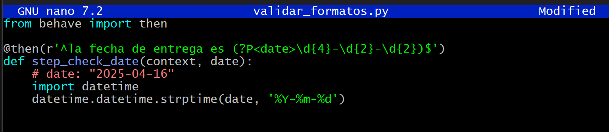

# Practica dirigida 3

## Herramientas del shell
1. Lee la ayuda de man ls y escribe un comando ls que liste archivos de la siguiente manera:

## Bash

**Paso 1**: Abrir la terminal y verificar Bash

**Paso 2**: "Hello, World!": tu primer script

**Paso 3**: Asignación de variables

**Paso 4**: Parámetros posicionales

**Paso 5**: Arrays en Bash

**Paso 6**: Expansiones
* **Aritmetica**

* **Substitucion de comandos**

* **Otras**

**Paso 7**: Pipes y redirección

**Paso 8**: Condicionales
* **if**

* **case**

**Paso 9**: Bucles

**Paso 10**: Funciones

**Paso 11**: Depuración

**Paso 12**: Expresiones regulares en Bash

**Paso 13**: Expresiones regulares en Python
* Crea extract_emails.py:

* **Validar nombre de rama**

* **Validar mensaje de commit**

* **Validar formato de tag semántico**

* **Extraer issue IDs de mensajes (`git log`)**

* **Detectar merges automáticos y extraer la rama objetivo**

* **Paso con grupo nombrado y alternancia**

* **Paso con partes opcionales y lookahead**

* **Validar formatos de fecha dentro de un paso**

* **Step definition para comandos Git**

* **Capturar tablas Gherkin con regex dinámico**

**Paso 14**:  BDD con behave

1. **Feature** (features/login.feature):

2. **Steps** (features/steps/login_steps.py)

**Paso 15**: Pipelines CI
* **GitHub actions (.github/workflows/ci.yml):**

* **Makefile local:**

