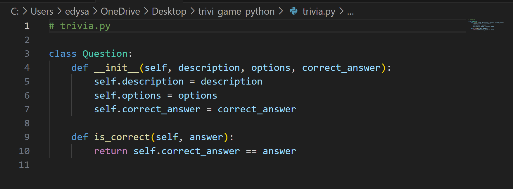
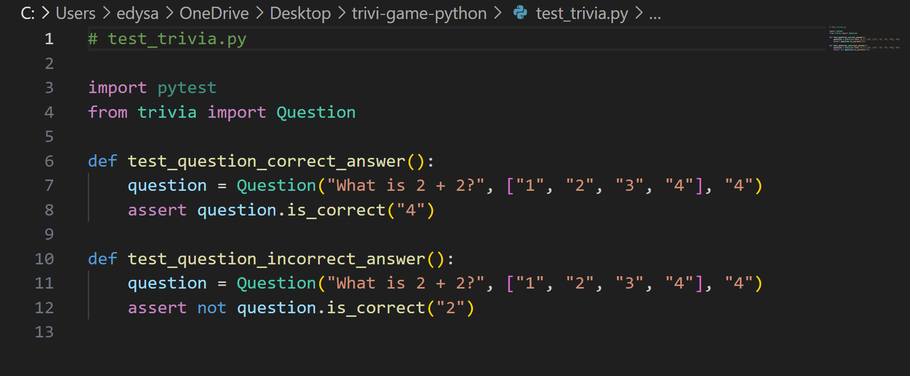
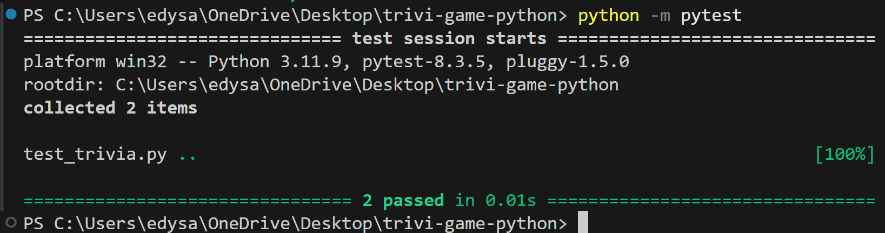
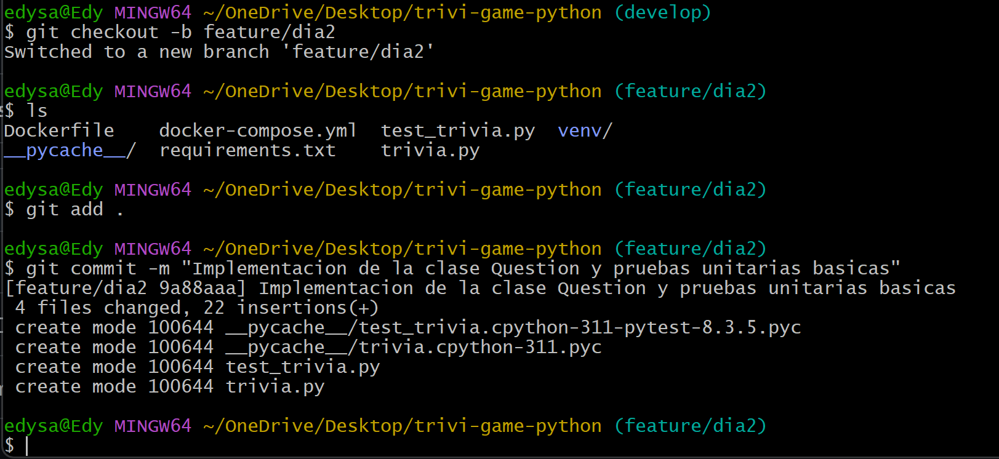
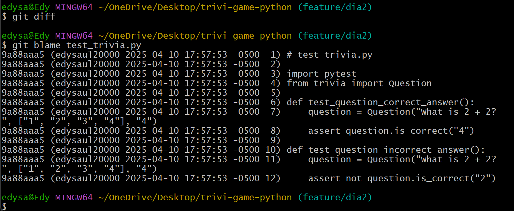
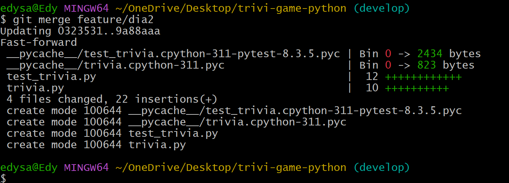

# Día 2 - Implementación de la clase Question y pruebas unitarias (Sprint 1 – Parte 2)

### Tareas y comandos Git
* Crear el archivo trivia.py con la clase:


* Crear el archivo test_trivia.py con pruebas unitarias:



* Ejecutar pytest para validar:
```            
pytest
```



* Realizar commit en la rama:
```
git add .
git commit -m "Implementación de la clase Question y pruebas unitarias básicas"
```


* Revisión diaria con Git

```
git diff
git blame test_trivia.py
```


* Parte final del dia2:
```
git checkout develop
git merge feature/dia2
```
