# Día 1 - Configuración del entorno y estructura básica (Sprint 1 – Parte 1)


### 1.  Configuración del proyecto y entorno virtual

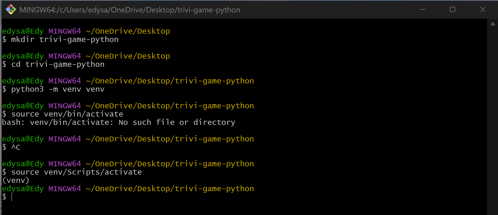

* **mkdir trivia-game-python**: Creamos una carpeta para el proyecto, esto nos ayuda a mantener todo el código y archivos organizados.

* **python3 -m venv venv**: Crea un entorno virtual llamado venv, que te permite instalar librerías solo para este proyecto sin afectar el sistema global.

* **source venv/bin/activate**: Activas ese entorno virtual, aqui tuve un problema ya que eso se aplicaba para Linux, para Windows se use **source venv/Scripts/activate**


### 2. Instalación de dependencias
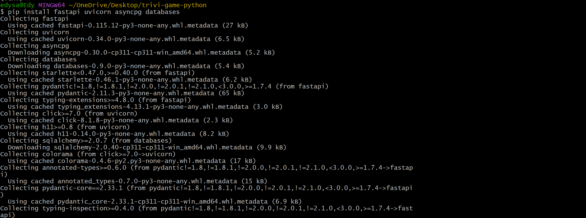
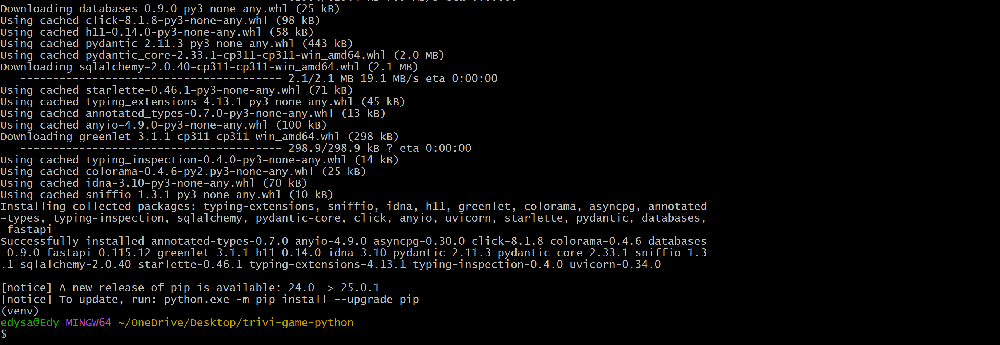

* **fastapi**: Framework web moderno para construir APIs rapidas.

* **uvicorn**: Servidor ASGI que ejecuta FastAPI.

* **asyncpg**: Driver de PostgreSQL compatible con FastAPI.

* **databases**: Libreria para manejar conexiones a bases de datos de forma asincrona.


### 3. Docker y Docker Compose

Aqui tube un problema, al abrir el **Doker Desktop** automaticamente se cerraba, aplique lo siguiente:

**Probar si tenia instalado correctamente los requisitos de doker(WSL2)**

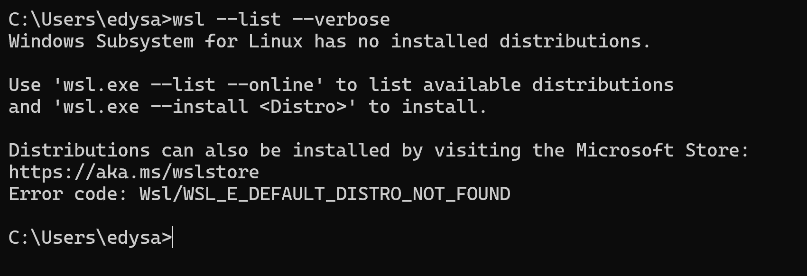

**Como no lo tenia instalado procedi a instalarlo**
Lo instale con el siguiente comando 

```
wsl --install
```
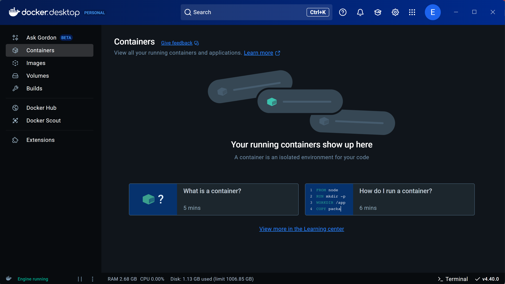

 ahora si me dispongo a crear el Dockerfile y docker-compose.yml
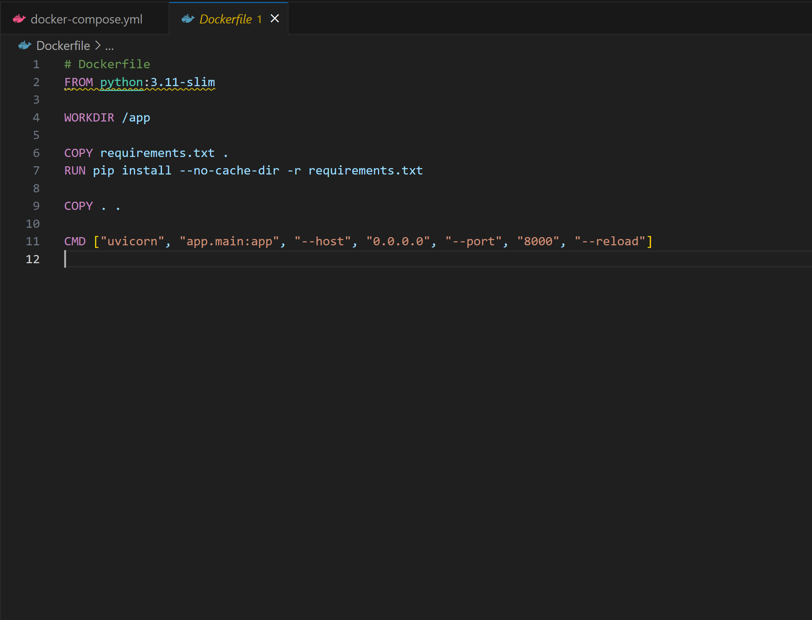
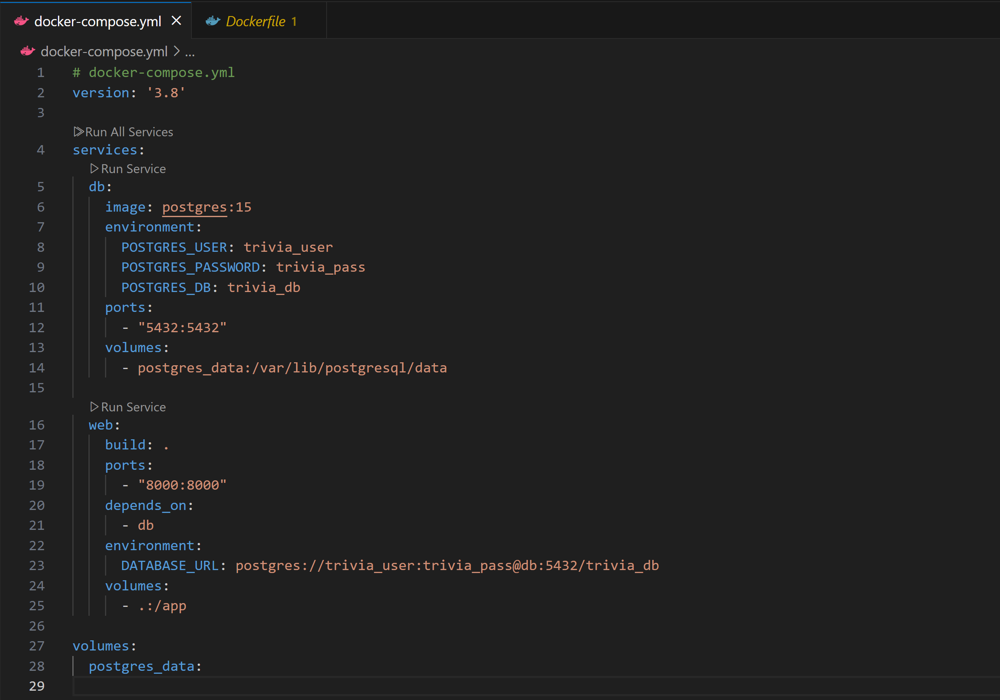


* El Dockerfile crea una imagen de tu aplicación con FastAPI lista para ejecutarse.

* El docker-compose.yml orquesta dos servicios: 
    * db: contenedor de PostgreSQL 
    * web: tu app FastAPI

Y finalmente creamos la imagen 
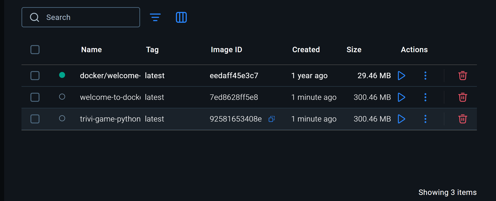


### 4. Inicialización de Git y ramas

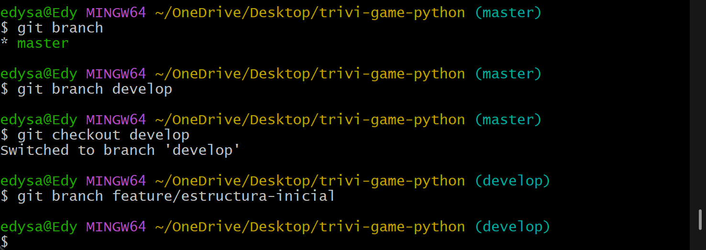

* **git init**: Inicias el repositorio Git.

* **develop**: Rama principal de desarrollo (no trabajas directamente en main para evitar errores en producción).

* **feature/estructura-inicial**: Rama específica para esta funcionalidad o tarea.


### 5. Commit inicial
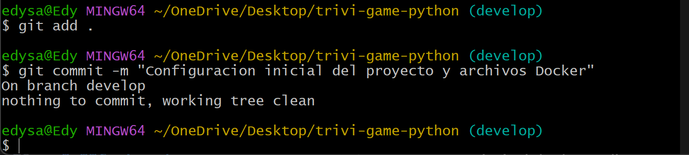

* **git add .**: Aniadimos todos los archivos al seguimiento de Git.

* **git commit**: Guardamos un punto de control con un mensaje claro de lo que hiciste.

### 6. Registro y revisión diaria

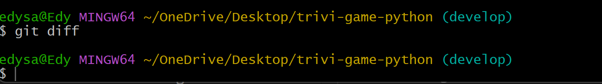

Cuando ejecutamos **git diff** después de un commit, no hay diferencias no confirmadas, ya que todos los cambios han sido agregados al commit, osea:

* Antes del commit, **git diff** muestra los cambios no guardados.

* Después del commit, **git diff** no muestra nada porque ya has guardado esos cambios.