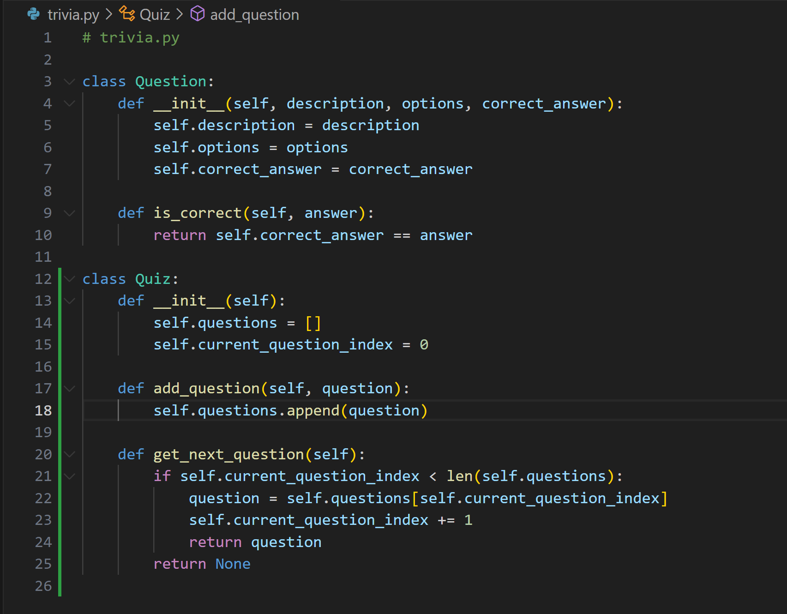
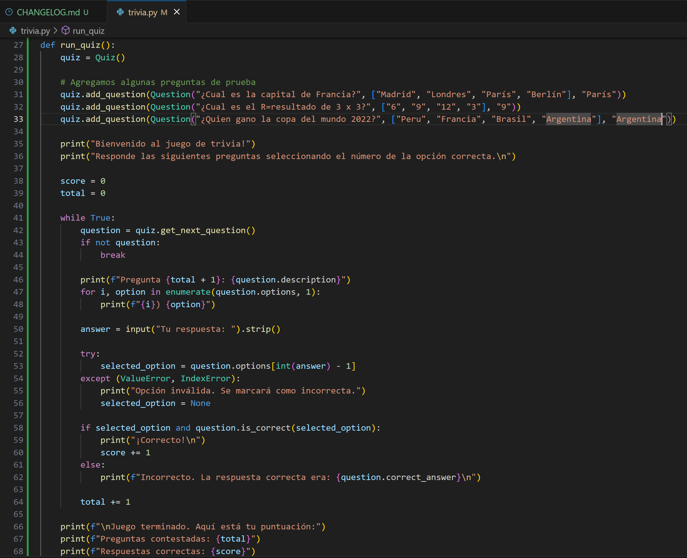
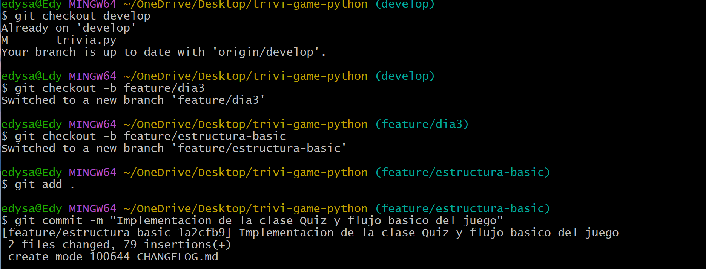
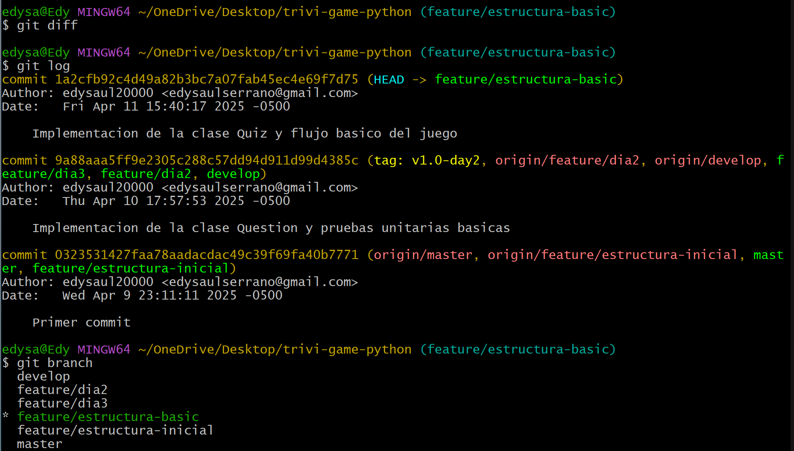

# Día 3 - Implementación de la clase Quiz y flujo básico del juego (Sprint 1 – Parte 3)

* ### Crear la clase Quiz en `trivia.py`

* `questions`: lista donde guardaremos las preguntas.

* `current_question_index`: lleva la cuenta de que pregunta toca mostrar.

* `add_question()`: nos permite ir agregando preguntas al juego.

* `get_next_question()`: devuelve la siguiente pregunta, o None si ya no hay más.

* ### Agregar lógica de interacción básica en una función (por ejemplo, run_quiz() que imprima las preguntas en consola).

* ### Realizar commit en la rama:

* ### Registro diario: Utilizar git diff para revisar cambios y git checkout para navegar entre ramas.
