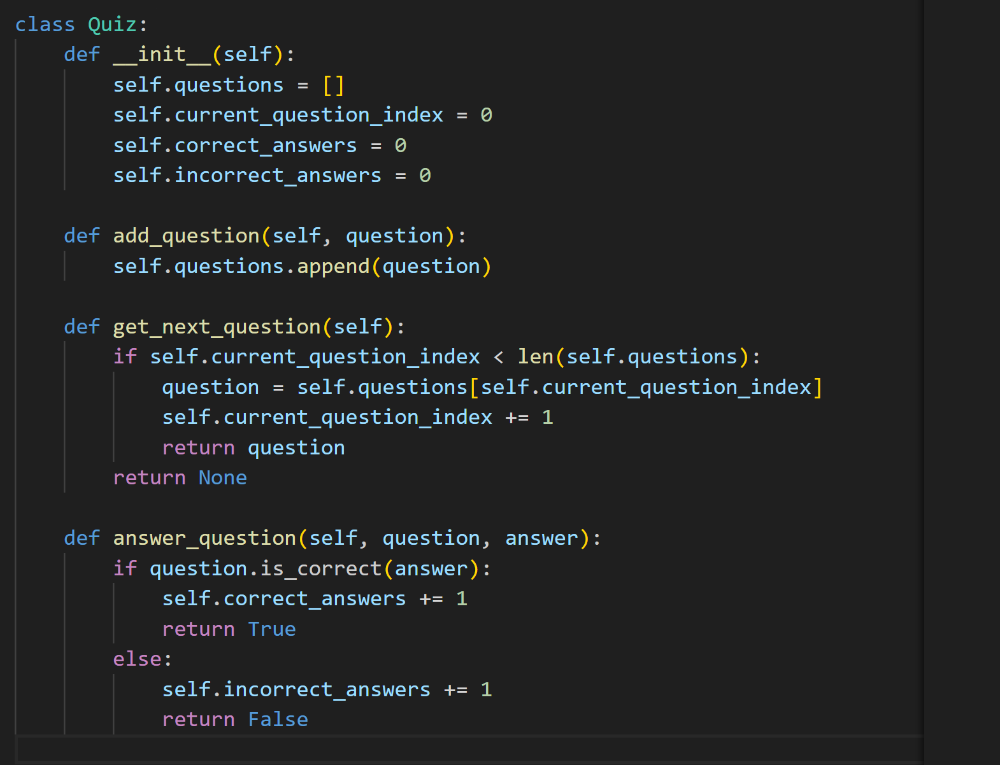
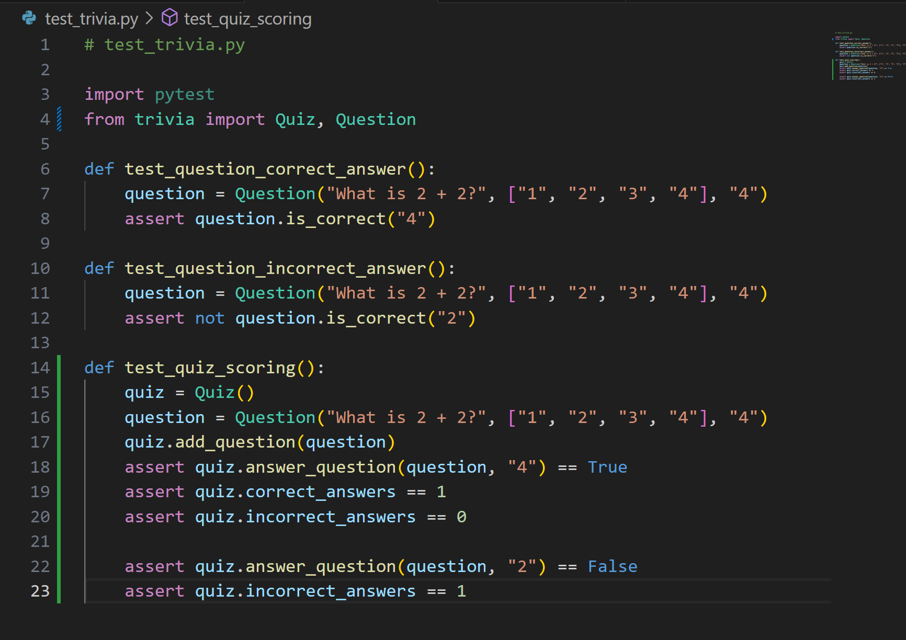
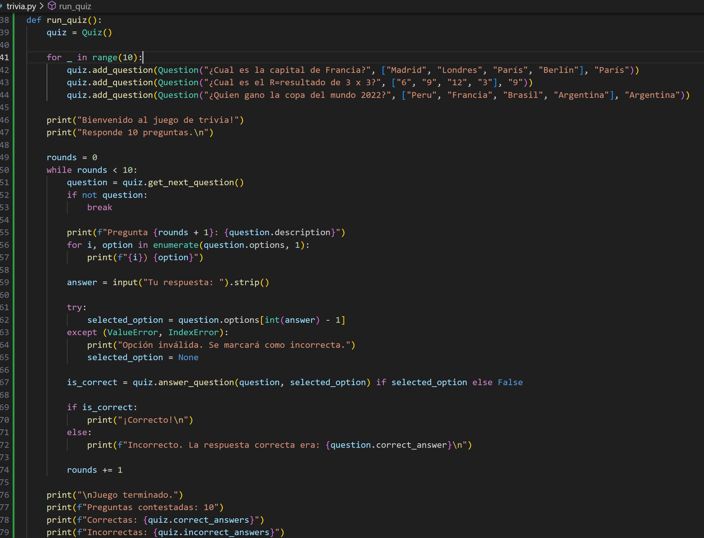
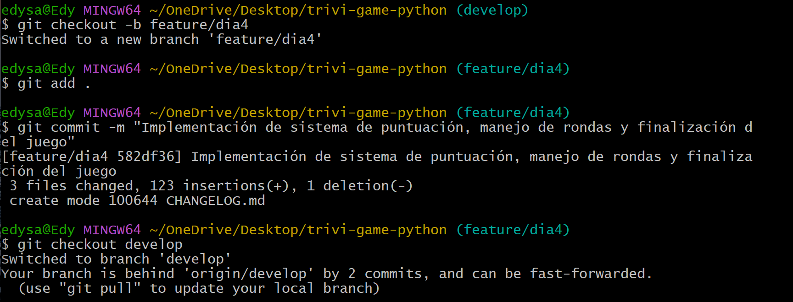
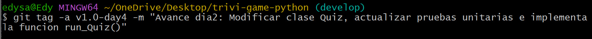
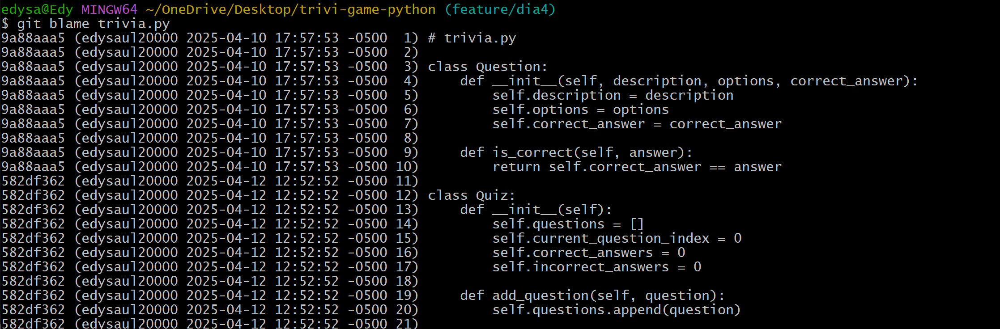
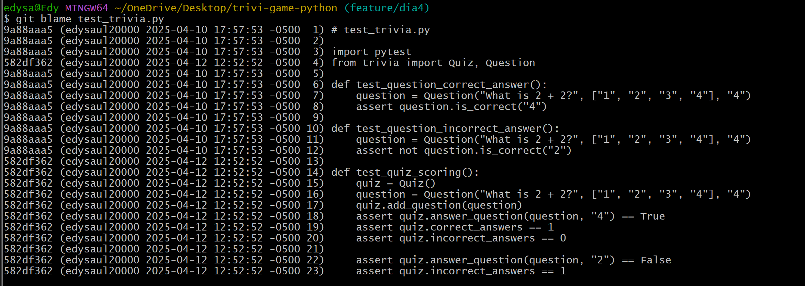

# Día 4 - Sistema de puntuación, manejo de rondas y finalización del juego (Sprint 2)

* ###  Modificar la clase `Quiz`:

* ### Actualizar las pruebas unitarias para incluir la verificación de la puntuación:

* ### Implementar la función `run_quiz()` para el flujo de 10 rondas.

* ### Realizar commit:

* ### Registro diario: Usamos `git blame`

