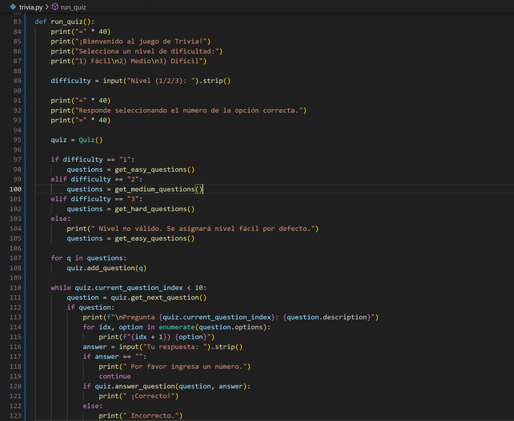
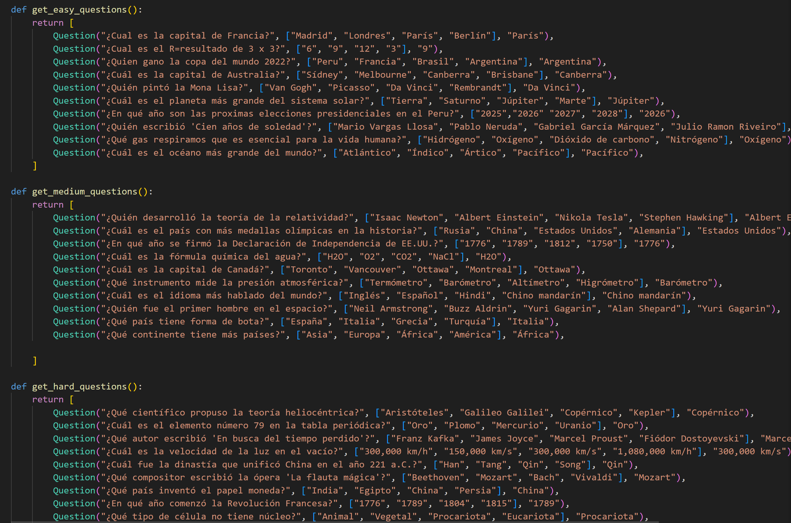
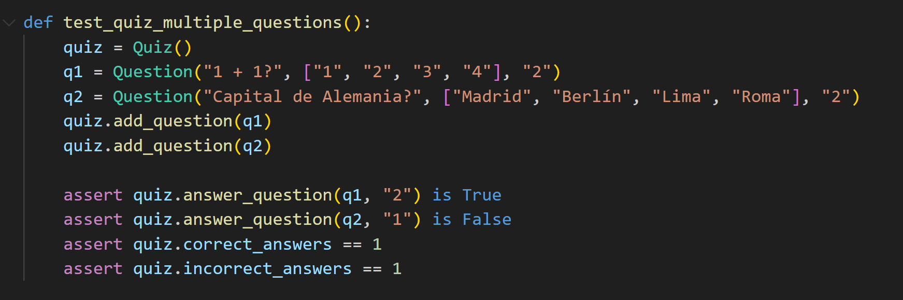
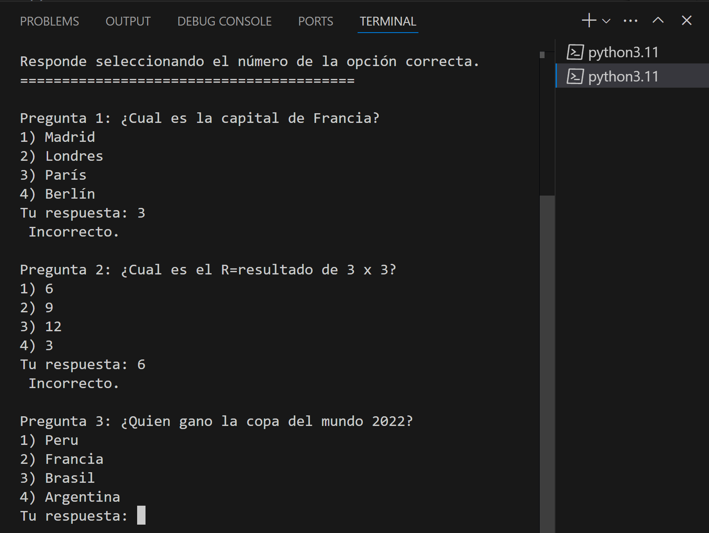
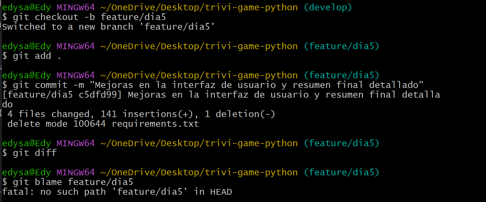
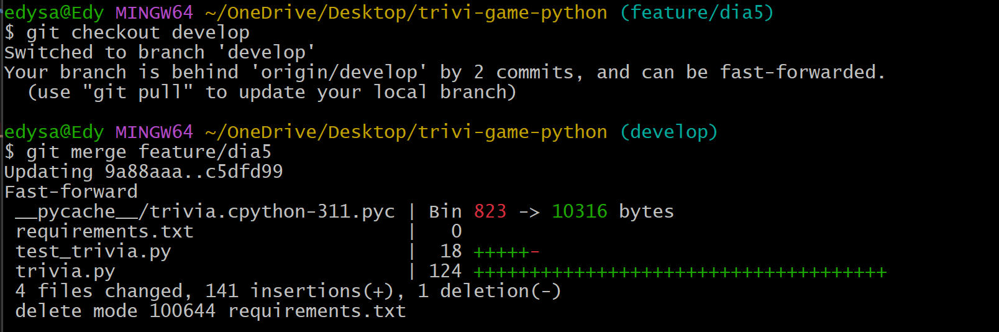
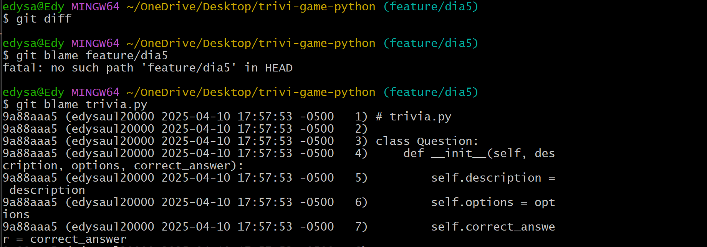

# Día 5 - Mejoras en la interfaz de usuario y refinamientos (Sprint 3)

* ### Mejorar la función `run_quiz()`:

* ### Realizar pruebas de la interfaz y ajustes en los mensajes.

* ### Crear y trabajar en la rama de mejoras:

* ### Revisar cambios con git diff y utilizar git blame para asegurar que cada parte del código se documente.

* ### Fusionar la rama en `develop`:
