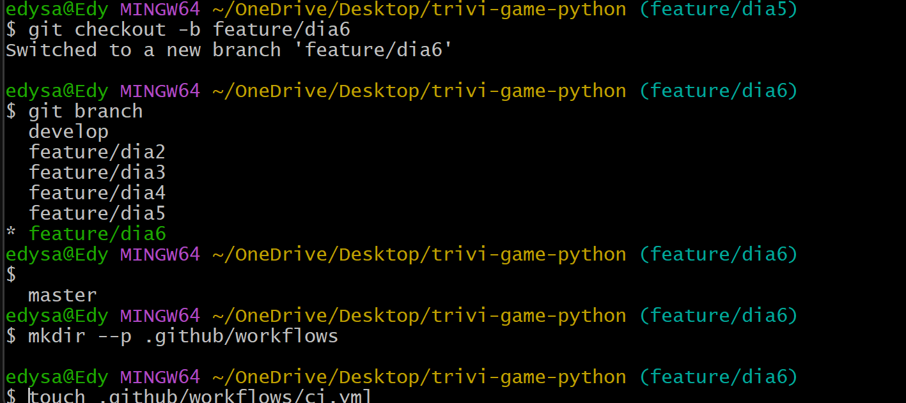
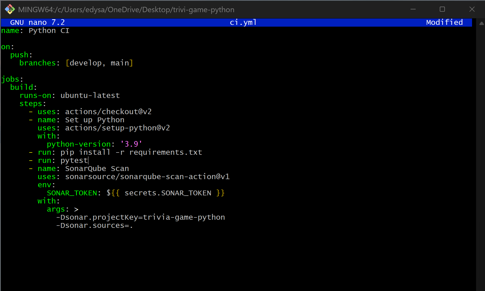
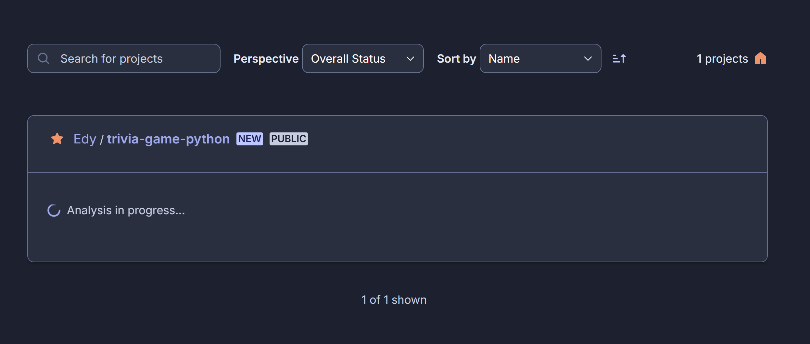
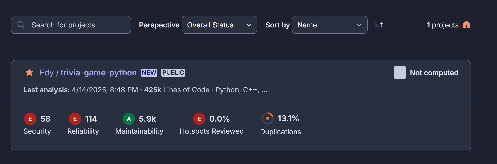
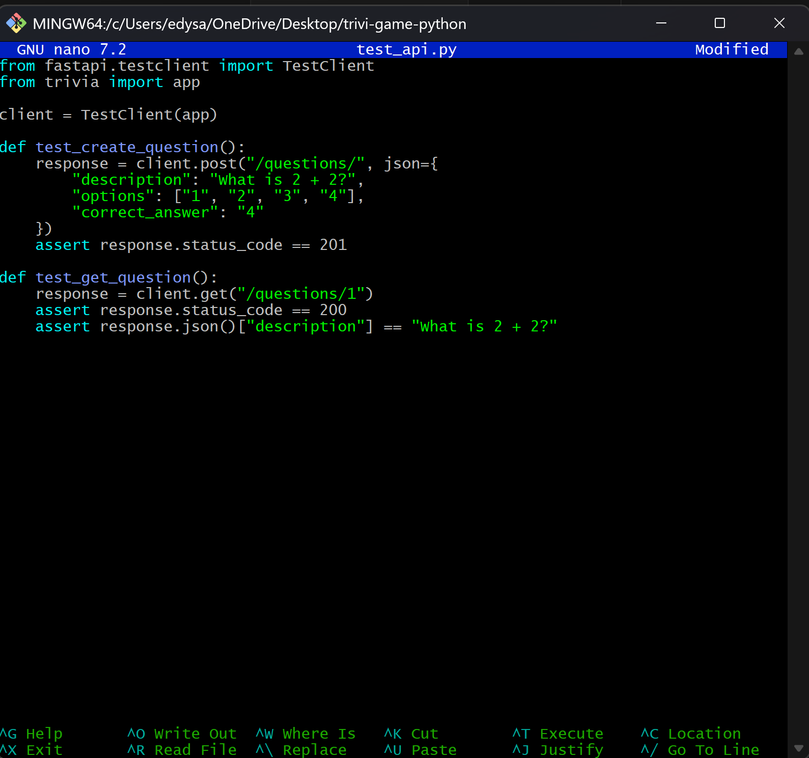
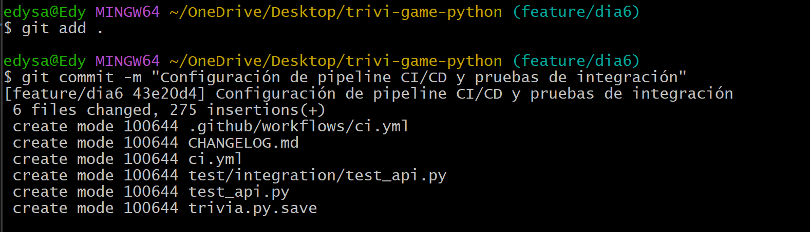
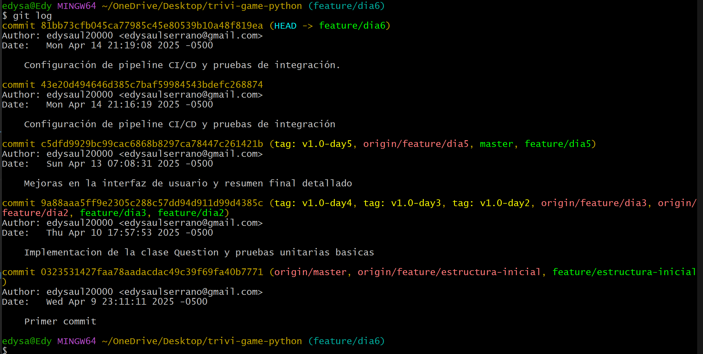
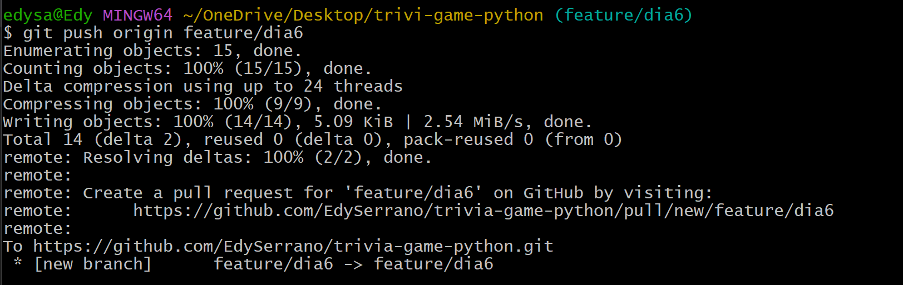
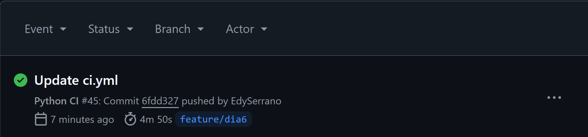

#Día 6 - Pipeline CI/CD y pruebas de integración

* ### Crear rama para CI/CD

* ### Crear archivo de workflow en GitHub Actions
Primero creamos la rama del dia donde trabajaremos:

Luego creamos el archivo:

* ### Configurar SonarQube

* ### Implementar pruebas de integración para la API

* ###  Realizar el commit

* ### Verificar cambios

* ### Pushea la rama a GitHub

* ### Validar pipeline en GitHub

