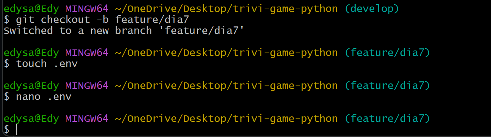
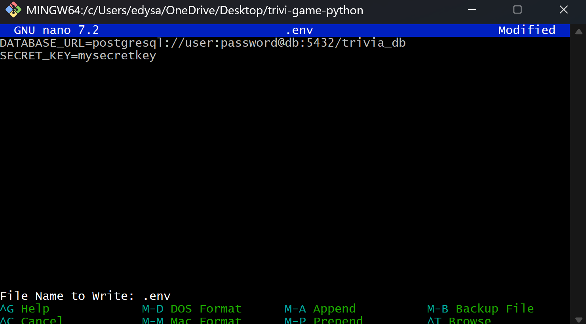
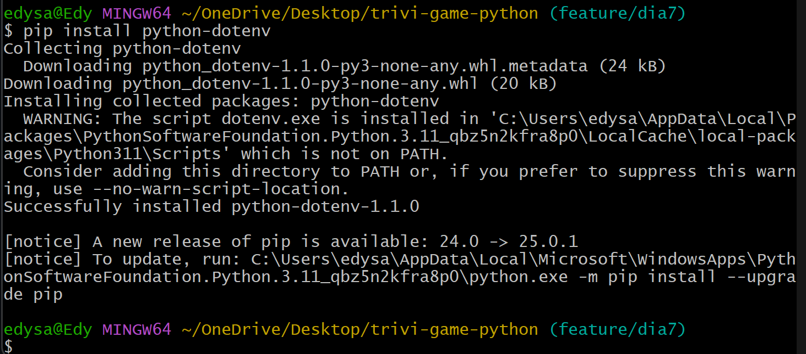
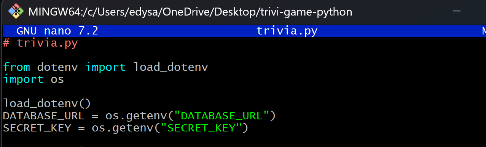
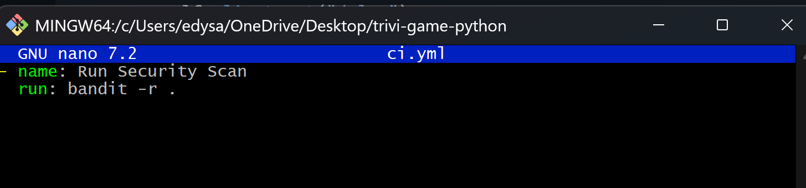
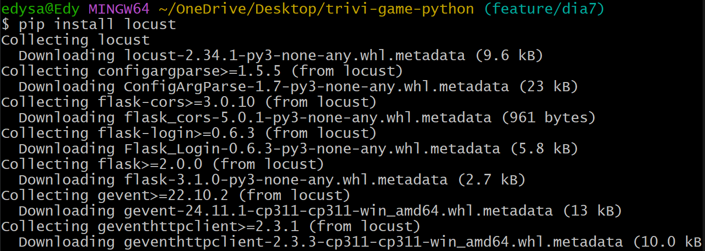
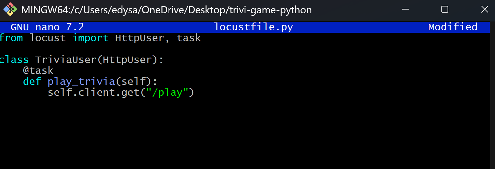
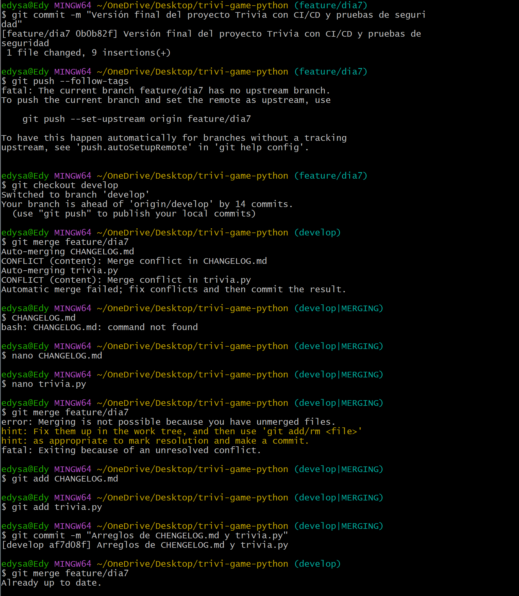

# Día 7 - Gestión de configuración, seguridad y pruebas de rendimiento

* ### Crear un archivo `.env` con:

* ### Modificar la aplicación para cargar variables:

* ### Agregar pruebas de seguridad con Bandit en el pipeline:

* ### Crear archivo `locustfile.py` para pruebas de carga:

* ### Realizar commit final y tagging:

